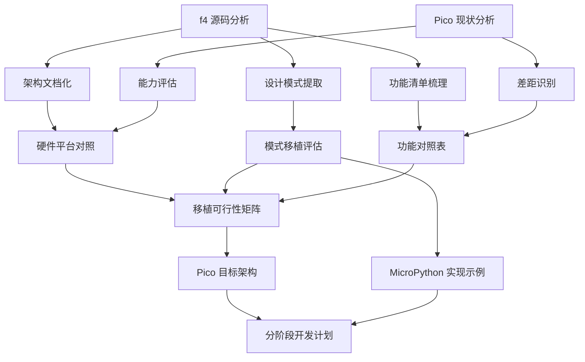
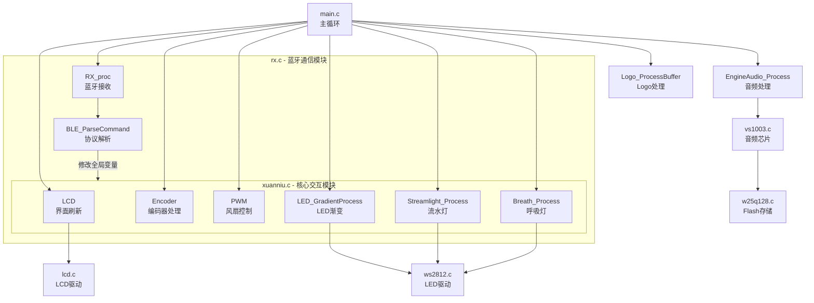
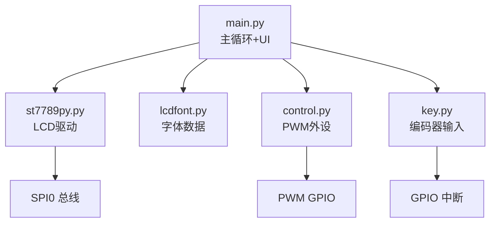
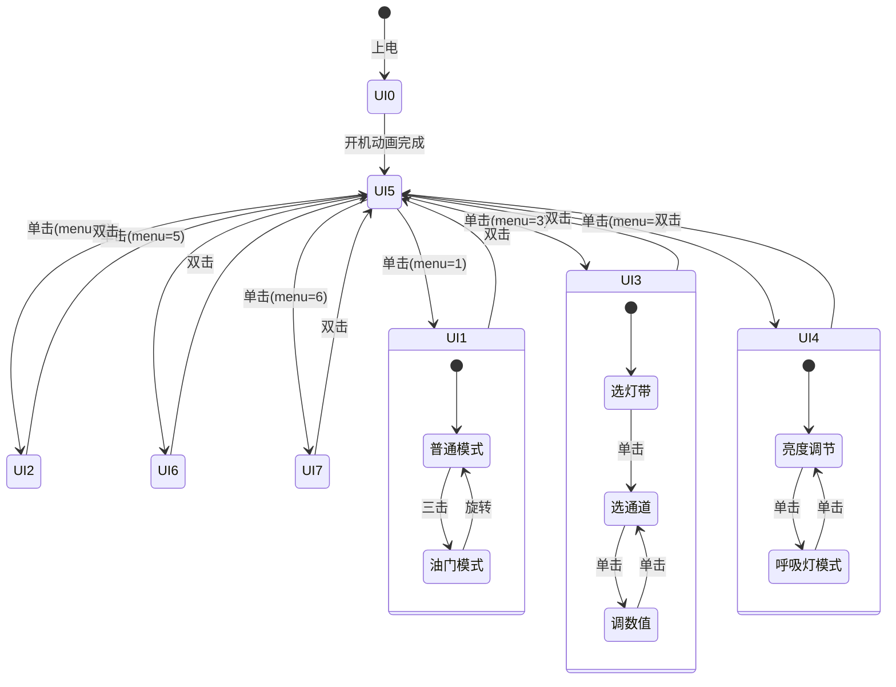
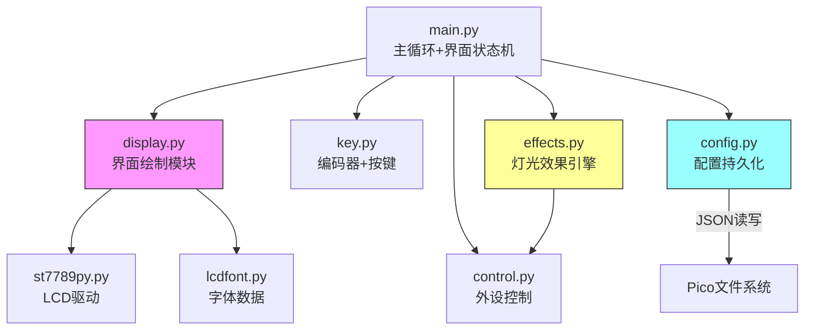

# 设计文档：F4 参考架构分析

## 概述

本设计文档详细描述如何系统性地分析 STM32F405 RideWind 项目（f4 项目），并将分析成果转化为 Raspberry Pi Pico MicroPython 项目的开发蓝图。

分析产出物为一系列结构化的文档和对照表，不涉及代码实现。核心产出包括：
1. f4 架构深度分析文档（模块、状态机、设计模式）
2. 硬件平台对照分析表
3. 功能移植可行性评估矩阵
4. f4→Pico 功能对照表
5. Pico 目标架构设计
6. 分阶段开发行动计划
7. 关键设计模式的 MicroPython 实现示例

## 架构

### 分析框架架构



### f4 项目软件架构（已分析）



### Pico 项目当前架构



## 组件与接口

### 分析产出物组件定义

| 组件编号 | 产出物名称 | 对应需求 | 格式 |
|---------|-----------|---------|------|
| D1 | f4 架构深度分析 | 需求1, 需求7 | Markdown 文档 |
| D2 | 硬件平台对照表 | 需求2 | Markdown 表格 |
| D3 | 功能移植可行性矩阵 | 需求3 | Markdown 表格 |
| D4 | f4→Pico 功能对照表 | 需求4 | Markdown 表格 |
| D5 | Pico 目标架构设计 | 需求5 | Markdown + Mermaid |
| D6 | 分阶段开发计划 | 需求6 | Markdown 文档 |
| D7 | 设计模式 MicroPython 示例 | 需求7 | Markdown + 代码块 |

所有产出物整合在一份综合分析文档中，按章节组织。

### D1: f4 架构深度分析 - 内容结构

**模块依赖关系图**：基于源码 `#include` 和 `extern` 分析，绘制完整的模块调用关系。

**界面状态机分析**：

| UI编号 | 名称 | 进入条件 | 退出条件 | 初始化(chu) | 关键变量 |
|--------|------|---------|---------|------------|---------|
| UI0 | 开机动画 | 上电自动 | 自动进入UI5 | chu=0 | - |
| UI1 | 调速界面 | menu_selected=1 | 双击→UI5 | chu=1 | Num, current_speed_kmh, wuhuaqi_state |
| UI2 | 颜色预设 | menu_selected=2 | 双击→UI5 | chu=2 | deng_num(1-14), deng_2or3, pei_se_state |
| UI3 | RGB调色 | menu_selected=3 | 双击→UI5 | chu=3 | ui3_mode(0-2), ui3_channel(0-2), name(0-3) |
| UI4 | 亮度调节 | menu_selected=4 | 双击→UI5 | chu=4 | bright(0-100), breath_mode |
| UI5 | 菜单界面 | 双击返回/开机 | 单击进入子界面 | chu=5 | menu_selected(1-6) |
| UI6 | Logo界面 | menu_selected=5 | 双击→UI5 | chu=6 | logo_view_slot(0-2) |
| UI7 | 音量调节 | menu_selected=6 | 双击→UI5 | chu=7 | volume(0-100) |

**界面状态转换图**：



### D2: 硬件平台对照表 - 内容结构

**核心参数对比**：

| 参数 | STM32F405RGTx | Raspberry Pi Pico | 差异影响 |
|------|--------------|-------------------|---------|
| CPU | ARM Cortex-M4 168MHz | ARM Cortex-M0+ 133MHz 双核 | Pico 单核性能较低，但有双核 |
| RAM | 192KB SRAM | 264KB SRAM | Pico 略多 |
| Flash | 1MB 内置 | 2MB 内置 | Pico 更多，但 MicroPython 占用大 |
| 外部 Flash | W25Q128 16MB (SPI2) | 无（可外接） | Pico 需用内置文件系统替代 |
| PWM 通道 | TIM1-TIM14 多通道 | 16 通道 (8 slice) | Pico 足够 |
| SPI 总线 | SPI1/SPI2/SPI3 | SPI0/SPI1 | Pico 少一路，需复用 |
| DMA | 2 个 DMA 控制器 | 12 通道 DMA | Pico DMA 在 MicroPython 中不可直接用 |
| 硬件编码器 | TIM1 编码器模式 | 无硬件编码器 | Pico 用 GPIO 中断软件实现 |
| UART | USART1/2, UART4/5 | UART0/UART1 | Pico 足够 |
| 语言 | C (HAL库) | MicroPython | 实时性差异显著 |

**GPIO 功能对照**：

| 功能 | f4 引脚 | f4 外设 | Pico 引脚 | Pico 外设 | 状态 |
|------|---------|---------|-----------|-----------|------|
| 风扇 PWM | PC6 | TIM3_CH1 | GPIO6 | PWM3A | ✅ 已实现 |
| 雾化器 | PB8 | GPIO | GPIO12 | PWM(发烟器) | ⚠️ 功能不同 |
| 编码器 A | PE9 | TIM1_CH1 | GPIO20 | GPIO中断 | ✅ 已实现(软件) |
| 编码器 B | PE11 | TIM1_CH2 | GPIO21 | GPIO中断 | ✅ 已实现(软件) |
| 编码器按键 | PA10 | GPIO | GPIO19 | GPIO中断 | ✅ 已实现 |
| LCD SCK | PA5 | SPI1 | GPIO2 | SPI0 | ✅ 已实现 |
| LCD MOSI | PA7 | SPI1 | GPIO3 | SPI0 | ✅ 已实现 |
| LCD DC | - | GPIO | GPIO0 | GPIO | ✅ 已实现 |
| LCD CS | - | GPIO | GPIO1 | GPIO | ✅ 已实现 |
| LCD RST | - | GPIO | GPIO5 | GPIO | ✅ 已实现 |
| WS2812B ×4 | 多引脚 | TIM+DMA | - | - | ❌ 未实现 |
| COB1 R/G/B | - | - | GPIO13/14/15 | PWM | ✅ 已实现 |
| COB2 R/G/B | - | - | GPIO7/8/9 | PWM | ✅ 已实现 |
| 蓝牙 TX/RX | PA2/PA3 | UART2 | - | - | ❌ 未实现 |
| 音频 VS1003 | PB3/4/5 | SPI3 | - | - | ❌ 不移植 |
| Flash W25Q128 | PC10/11/12 | SPI2 | - | - | ❌ 用文件系统替代 |
| 小风扇 | - | - | GPIO10 | PWM | ✅ Pico独有 |
| 气泵 | - | - | GPIO11 | PWM | ✅ Pico独有 |

### D3: 功能移植可行性矩阵 - 内容结构

| 功能模块 | f4 实现 | 移植评级 | 优先级 | 技术难点/方案 |
|---------|---------|---------|--------|-------------|
| 界面状态机 (UI0-UI7) | ui/chu 全局变量 | ✅ 直接移植 | P0 | 用 Python 类/字典替代 C 全局变量 |
| 编码器增量管理 | TIM1 硬件编码器 | ✅ 直接移植 | P0 | 已有 GPIO 中断实现，需加统一分发 |
| 按键事件系统 | GPIO 中断+定时器 | ✅ 直接移植 | P0 | 已有实现，需加三击支持 |
| 风扇 PWM 控制 | TIM3 PWM | ✅ 直接移植 | P0 | 已实现 |
| COB 灯带 RGB | - (f4用WS2812B) | ✅ 已实现 | P0 | Pico 独有，PWM 驱动 |
| LCD 界面绘制 | SPI1 240×240 | ⚠️ 需适配 | P0 | 屏幕尺寸不同(76×284 vs 240×240)，需重新设计布局 |
| 菜单导航系统 | 全屏滑动式 2×2 网格 | ⚠️ 需适配 | P1 | 76×284 横屏需要不同的菜单布局方案 |
| 颜色预设系统 | 14种预设+流水灯 | ⚠️ 需适配 | P1 | COB 灯带只有2条(vs f4的4条WS2812B) |
| RGB 调色三层状态机 | ui3_mode 0/1/2 | ⚠️ 需适配 | P1 | 2条COB灯带，简化为选灯带→选通道→调值 |
| 亮度调节+呼吸灯 | bright + breath_mode | ⚠️ 需适配 | P1 | 呼吸灯需 Timer 实现正弦波 |
| LED 效果优先级 | 标志位互斥 | ⚠️ 需适配 | P1 | 简化为 COB 模式切换 |
| Flash 持久化 | W25Q128 SPI Flash | ⚠️ 需适配 | P1 | 用 Pico 内置文件系统 JSON 文件替代 |
| 蓝牙通信 | JDY-08 UART2 | ⚠️ 需适配 | P2 | 需外接蓝牙模块(HC-05/JDY-08)，用 UART 实现 |
| 开机动画 | Logo + 双闪 + 引擎声 | ⚠️ 需适配 | P2 | 简化为 Logo + COB 灯效 |
| Logo 上传 | APP→Flash 3槽位 | ⚠️ 需适配 | P2 | 用文件系统存储，需蓝牙先实现 |
| 音频播放 | VS1003 + Flash MP3 | ❌ 不可移植 | - | Pico 无音频解码硬件，可用蜂鸣器替代简单音效 |
| DMA LED 驱动 | TIM+DMA WS2812B | ❌ 不可移植 | - | MicroPython 无法直接用 DMA，Pico 用 PIO 可驱动 WS2812B |

### D4: 功能对照表 - 内容结构

**界面对照**：

| f4 界面 | f4 功能 | Pico 当前 | Pico 目标 | 差异说明 |
|---------|---------|-----------|-----------|---------|
| UI0 开机动画 | Logo+双闪+引擎声 | LOGO_SCREEN(Hello World) | Logo+COB灯效 | 去掉音频，加COB动画 |
| UI1 调速 | 0-340km/h+油门模式 | WINDSPEED_SCREEN(0-100%) | 风速+小风扇+气泵联动 | 增加多设备联动 |
| UI2 颜色预设 | 14种+流水灯 | - | COB预设+渐变效果 | 适配2条COB灯带 |
| UI3 RGB调色 | 4灯带×RGB三层状态机 | RGBCONTROL_SCREEN(单COB) | 2条COB独立RGB调色 | 简化为2灯带 |
| UI4 亮度调节 | 0-100%+呼吸灯 | - | COB亮度+呼吸灯 | 新增 |
| UI5 菜单 | 全屏滑动2×2网格 | MODE_SELECT_SCREEN(3选项) | 横屏滚动菜单(6+选项) | 重新设计布局 |
| UI6 Logo | 3槽位自定义图片 | - | 可选(P2) | 依赖蓝牙 |
| UI7 音量 | 0-100% | - | 不移植 | 无音频硬件 |
| - | - | SMOKESPEED_SCREEN | 发烟控制 | Pico独有 |

**设计模式对照**：

| f4 设计模式 | f4 实现方式 | Pico 当前状态 | Pico 移植建议 |
|------------|-----------|-------------|-------------|
| 界面状态机 | ui/chu 全局 u8 变量 | current_screen 全局变量 | 保持变量方式，增加 init_flag 机制 |
| 编码器增量统一管理 | Encoder()开头读一次，encoder_delta全局分发 | get_encoder_dir()每次返回±1 | 改为每帧读一次delta，全局分发 |
| 按键逻辑按界面分发 | switch(ui) 内处理 | if/elif current_screen 分发 | 保持当前方式，增加界面处理函数 |
| LED效果优先级 | deng_2or3/breath_mode标志位互斥 | 无 | 增加 led_mode 状态变量管理 |
| 子状态重置 | chu变量触发一次性初始化 | switch_screen()重绘 | 增加 screen_init() 机制 |
| Flash持久化 | W25Q128 扇区擦写 | 无 | 用 JSON 文件 + 脏标志 |
| 蓝牙命令中转 | UI:X→menu→auto_enter | 无 | 预留接口，P2阶段实现 |
| _zhong临时变量 | 编辑中用_zhong，确认后同步 | 直接修改全局变量 | 增加编辑缓冲区机制 |

### D5: Pico 目标架构设计 - 内容结构

**目标模块架构**：



**目标文件结构**：

```
📁 项目根目录/
├── main.py          # 主循环 + 界面状态机 + 交互分发
├── display.py       # 🆕 界面绘制模块（从main.py拆分）
├── effects.py       # 🆕 灯光效果引擎（呼吸灯/渐变/预设）
├── config.py        # 🆕 配置持久化（JSON文件读写）
├── control.py       # 外设PWM控制（已有，需扩展）
├── key.py           # 编码器+按键输入（已有，需优化）
├── st7789py.py      # LCD驱动（已有，不变）
├── lcdfont.py       # 字体数据（已有，不变）
└── settings.json    # 🆕 持久化配置文件
```

### D6: 分阶段开发计划 - 详细内容

**阶段划分**：

| 阶段 | 目标 | 涉及文件 | 里程碑 | 技术风险 |
|------|------|---------|--------|---------|
| Phase 0 | 架构重构基础 | main.py, display.py, config.py | 界面状态机重构，配置持久化，代码拆分 | MicroPython import 循环依赖 |
| Phase 1 | 菜单系统+新界面 | main.py, display.py | 6选项横屏菜单，风速/发烟/气泵/预设/RGB/亮度独立界面 | 76×284 横屏布局设计 |
| Phase 2 | 灯光效果系统 | effects.py, control.py | 12种颜色预设、呼吸灯、渐变过渡 | Timer 精度和 CPU 占用 |
| Phase 3 | 交互增强+持久化 | main.py, key.py, config.py | 三击支持、油门模式、JSON配置保存 | 编码器中断与主循环竞争 |

**蓝牙通信暂不纳入计划**，后续需要时再创建独立 spec。

**Phase 0 详细设计**：

核心任务：将 main.py 的界面绘制逻辑拆分到 display.py，建立 f4 风格的 ui/init_flag 状态机。

```python
# main.py 重构后的主循环结构（参考 f4 的 while(1) 循环）
while True:
    encoder_delta = get_encoder_delta()  # 统一读取一次
    key_event = get_key_event()
    
    handle_input(encoder_delta, key_event)  # 按界面分发交互
    update_display()  # 界面刷新（含初始化检测）
    update_effects()  # 灯光效果处理
    update_hardware()  # 硬件同步
    sleep_ms(10)
```

**Phase 1 详细设计**：

目标界面体系（参考 f4，适配 Pico 硬件）：

| 界面编号 | 名称 | 功能 | 参考 f4 |
|---------|------|------|---------|
| UI0 | 开机动画 | Logo + COB灯效 | f4 UI0 |
| UI1 | 风速控制 | 主风扇+小风扇 0-100% | f4 UI1 |
| UI2 | 发烟控制 | 发烟器 0-100% | Pico独有 |
| UI3 | 气泵控制 | 气泵 0-100% | Pico独有 |
| UI4 | 灯光预设 | 12种COB颜色预设+渐变 | f4 UI2 |
| UI5 | RGB调色 | 2条COB独立RGB调色 | f4 UI3 |
| UI6 | 亮度调节 | COB亮度+呼吸灯 | f4 UI4 |
| UI_MENU | 菜单 | 横屏滚动菜单 | f4 UI5 |

UI 先用文字+进度条做 demo，后续再美化。

### D7: 设计模式 MicroPython 示例 - 内容结构

为每个关键设计模式提供可直接用于 Pico 项目的 MicroPython 代码示例：

1. **界面状态机** - ui/init_flag 双变量协作
2. **编码器增量统一管理** - 每帧读取一次，全局分发
3. **LED效果优先级** - led_mode 枚举 + 互斥控制
4. **配置持久化** - JSON 文件 + 脏标志延迟写入
5. **编辑缓冲区** - _zhong 临时变量模式的 Python 实现
6. **按键事件系统** - 单击/双击/三击/长按完整实现

## 数据模型

### 分析文档数据结构

本 spec 的产出物是文档，不涉及运行时数据模型。但为了指导后续 Pico 开发，这里定义 Pico 目标架构中的关键数据结构：

**Pico 配置数据模型 (settings.json)**：

```json
{
    "fan_speed": 0,
    "smoke_speed": 0,
    "cob1_rgb": [0, 0, 0],
    "cob2_rgb": [0, 0, 0],
    "brightness": 100,
    "color_preset": 1,
    "led_mode": "normal",
    "last_ui": 1
}
```

**Pico 界面状态数据模型**：

```python
# 界面状态（参考f4的ui/chu机制）
ui = 5              # 当前界面编号
init_flag = True    # 界面初始化标志（对应f4的chu）
menu_selected = 1   # 菜单选中项

# 编码器增量（参考f4的encoder_delta统一管理）
encoder_delta = 0   # 每帧读取一次

# LED效果状态（参考f4的优先级系统）
led_mode = 'normal'  # 'normal' | 'preset' | 'breathing' | 'gradient'
breath_phase = 0
color_preset_idx = 0
```

**Pico 颜色预设数据模型**（参考f4的14种预设）：

```python
COLOR_PRESETS = [
    {"name": "赛博霓虹", "cob1": (138, 43, 226), "cob2": (0, 255, 128)},
    {"name": "冰晶青",   "cob1": (0, 234, 255),  "cob2": (0, 234, 255)},
    {"name": "日落熔岩", "cob1": (255, 100, 0),   "cob2": (0, 200, 255)},
    {"name": "竞速黄",   "cob1": (255, 210, 0),   "cob2": (255, 210, 0)},
    {"name": "烈焰红",   "cob1": (255, 0, 0),     "cob2": (255, 0, 0)},
    {"name": "警灯双闪", "cob1": (255, 0, 0),     "cob2": (0, 80, 255)},
    {"name": "樱花绯红", "cob1": (255, 105, 180),  "cob2": (255, 0, 80)},
    {"name": "极光幻紫", "cob1": (180, 0, 255),   "cob2": (0, 255, 200)},
    {"name": "暗夜紫晶", "cob1": (148, 0, 211),   "cob2": (148, 0, 211)},
    {"name": "薄荷清风", "cob1": (0, 255, 180),   "cob2": (100, 200, 255)},
    {"name": "丛林猛兽", "cob1": (0, 255, 65),    "cob2": (0, 255, 65)},
    {"name": "纯净白",   "cob1": (225, 225, 225), "cob2": (225, 225, 225)},
]
```

## 正确性属性

*正确性属性是一种在系统所有有效执行中都应成立的特征或行为——本质上是关于系统应该做什么的形式化陈述。属性是人类可读规范与机器可验证正确性保证之间的桥梁。*

本 spec 是一个分析和规划 spec，所有需求都是文档产出需求（要求生成特定内容的分析文档），不涉及可执行代码或可自动化测试的功能行为。因此，所有验收标准均为文档完整性和质量检查，需要人工审查，不适合作为属性基测试的目标。

无可测试的正确性属性。

## 错误处理

本 spec 的产出物是分析文档，不涉及运行时错误处理。但在分析过程中需要注意：

1. **源码分析不完整**：f4 项目的部分源文件可能过大无法完整读取。应通过多次分段读取和 grep 搜索确保关键逻辑被覆盖。
2. **功能遗漏**：分析可能遗漏 f4 项目的某些隐含功能。应交叉对照头文件声明和源文件实现，确保覆盖所有公开接口。
3. **平台差异评估偏差**：MicroPython 的性能限制可能被低估或高估。应在评估中标注不确定性，建议在实际开发中进行原型验证。

## 测试策略

由于本 spec 是分析和规划 spec，不涉及代码实现，因此不需要自动化测试。

**文档质量验证方式**：
- 人工审查：检查每个需求的验收标准是否在产出文档中得到满足
- 交叉验证：将分析结论与 f4 源码进行交叉对照，确保准确性
- 同行评审：由熟悉两个平台的开发者审查移植可行性评估的合理性

**后续开发阶段的测试**：
- 当基于本分析 spec 创建具体功能实现 spec 时，每个功能 spec 将包含自己的正确性属性和测试策略
- 建议使用 `fast-check`（如果使用 TypeScript 测试框架）或 `hypothesis`（如果使用 Python 测试框架）进行属性基测试
- 每个 MicroPython 代码示例应在 Pico 硬件上进行实际验证
