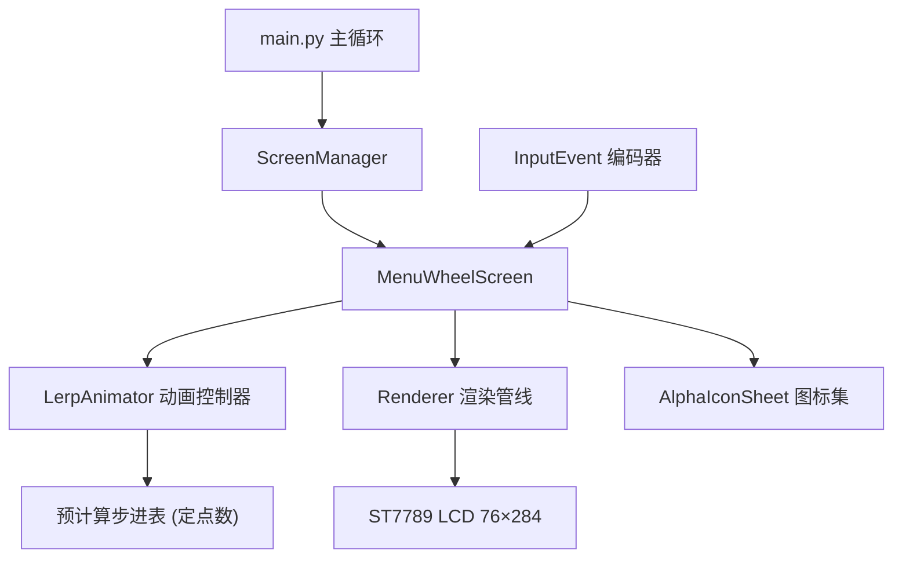
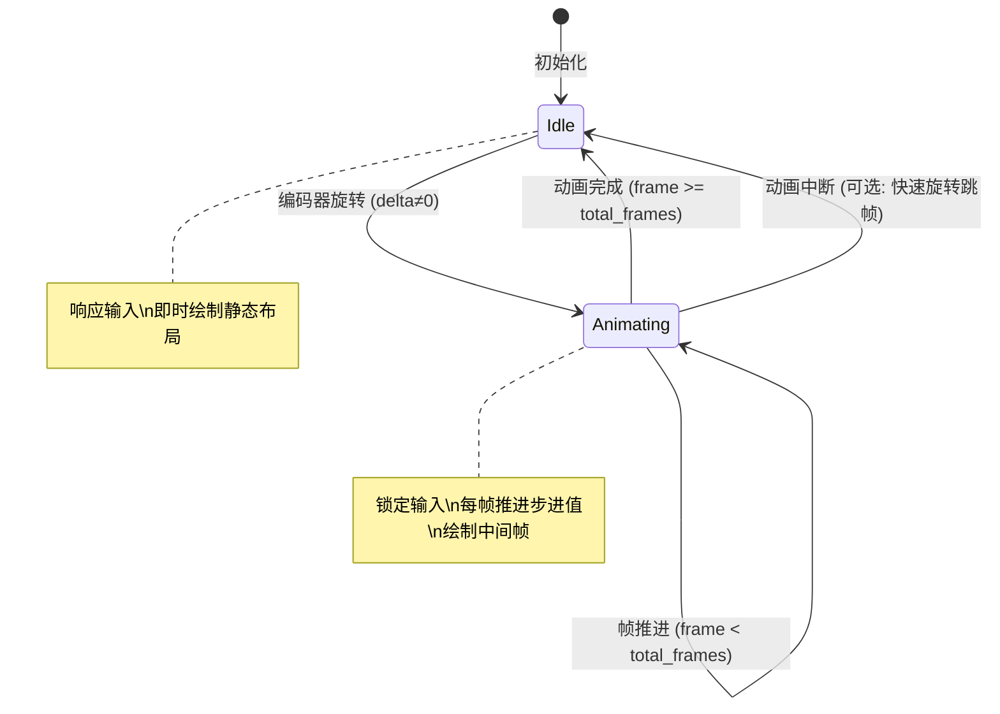
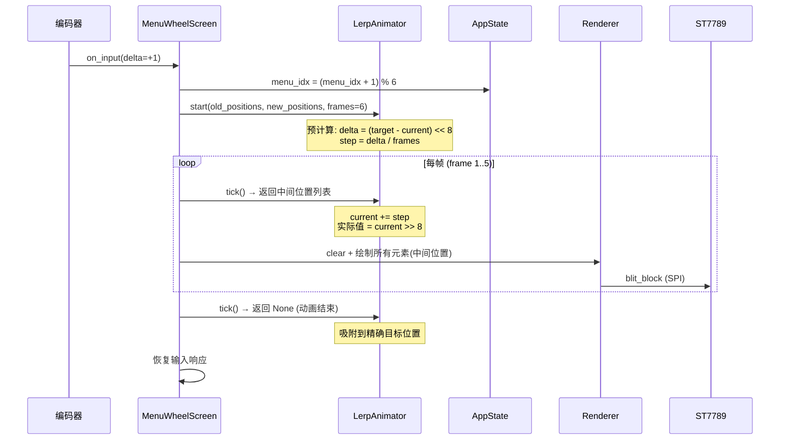

# 设计文档：菜单线性插值滑动过渡动画 (Menu Lerp Animation)

## 概述

本设计为现有的 `MenuWheelScreen` 水平滚轮菜单添加基于线性插值（lerp）的滑动过渡动画。当用户旋转编码器切换菜单项时，所有可见元素（图标位置 X、图标尺寸 W/H）从当前位置平滑过渡到目标位置，而非瞬间跳变。

核心设计原则参考 OLED 菜单演示代码中的 `Animation.c` 实现：预计算每帧步进量（delta/frame），使用 `<<8` 定点数避免浮点运算，在固定帧数内完成所有元素的同步平移和缩放。MicroPython 解释器是性能瓶颈（非 SPI），因此设计重点在于最小化每帧 Python 层计算量——预计算步进值、复用缓冲区、减少对象分配。

动画帧数可配置（默认 6 帧），帧数越少动画越快。动画期间锁定输入，动画结束后恢复响应。

## 架构



### 动画状态机



## 时序图

### 编码器旋转触发动画



## 组件与接口

### 组件1：LerpAnimator（动画控制器）

**职责**：管理多个元素的同步线性插值动画。预计算步进值，每帧推进，返回当前中间位置。纯整数运算，零浮点，零内存分配（动画期间）。

```python
class LerpAnimator:
    """多元素同步线性插值动画控制器。
    
    所有坐标使用 <<8 定点数，避免浮点运算。
    参考 OLED 演示代码 Animation.c 的 AnimationController 结构。
    """
    
    def __init__(self, max_elements=5):
        """预分配固定大小数组，避免动画期间内存分配。"""
    
    def start(self, old_slots, new_slots, frames=6):
        """启动动画：计算每个元素每个属性的步进值。
        
        old_slots: [(cx, icon_w, icon_h, fg_color), ...] 起始状态
        new_slots: [(cx, icon_w, icon_h, fg_color), ...] 目标状态
        frames: 动画总帧数
        """
    
    def tick(self):
        """推进一帧，返回当前中间位置列表或 None（动画结束）。
        
        返回: [(cx, icon_w, icon_h, fg_color), ...] 或 None
        """
    
    @property
    def is_active(self):
        """动画是否正在进行。"""
```

**设计决策**：
- 使用预分配的 `list` 而非每帧创建新对象
- 颜色不做插值（瞬间切换），仅位置和尺寸做 lerp
- 最后一帧强制吸附到精确目标值，消除累积误差

### 组件2：MenuWheelScreen（增强版）

**职责**：在现有即时切换逻辑基础上，集成 `LerpAnimator`。输入处理时启动动画，`draw_update` 中驱动动画帧推进。

```python
class MenuWheelScreen(Screen):
    def __init__(self, ctx):
        super().__init__(ctx)
        self._animator = LerpAnimator(max_elements=5)
        self._anim_slots = None  # 动画中间帧数据
    
    def on_input(self, event):
        """旋转时启动动画而非即时切换。"""
    
    def draw_update(self, r):
        """如果动画活跃，推进帧并绘制中间状态。"""
```

### 组件3：布局快照函数

**职责**：捕获当前布局状态和目标布局状态，供动画控制器使用。

```python
def snapshot_layout(selected_idx, total_count):
    """生成布局快照：每个可见槽位的 (cx, icon_w, icon_h, fg_color)。
    
    返回固定 5 个槽位的数据（对应 MAX_VISIBLE=5 个位置），
    不可见的槽位用屏幕外坐标表示。
    """
```

## 数据模型

### 动画槽位 (AnimSlot)

```python
# 每个槽位的属性（定点数 <<8）
# 使用扁平数组而非对象，最小化内存开销
#
# 索引布局 (每个槽位 4 个值):
#   [0] current_cx   当前 X 中心坐标 (<<8)
#   [1] current_w    当前图标宽度 (<<8)
#   [2] current_h    当前图标高度 (<<8)
#   [3] step_cx      X 步进值 (<<8)
#   [4] step_w       宽度步进值 (<<8)
#   [5] step_h       高度步进值 (<<8)
#   [6] target_cx    目标 X (<<8)
#   [7] target_w     目标宽度 (<<8)
#   [8] target_h     目标高度 (<<8)
#
# 5 个槽位 × 9 个 int = 45 个整数

SLOT_STRIDE = 9
MAX_SLOTS = 5
```

### 动画配置常量

```python
ANIM_FRAMES = 6        # 默认动画帧数 (越少越快)
FP_SHIFT = 8           # 定点数移位位数 (<<8 = ×256)
FP_HALF = 128          # 四舍五入用 (1 << 7)

# 槽位静态目标位置 (屏幕坐标)
# offset: -2, -1, 0, +1, +2
SLOT_CX = [
    CENTER_X - 2 * ITEM_SPACING,  # 14
    CENTER_X - 1 * ITEM_SPACING,  # 78
    CENTER_X,                      # 142
    CENTER_X + 1 * ITEM_SPACING,  # 206
    CENTER_X + 2 * ITEM_SPACING,  # 270
]
SLOT_ICON_W = [24, 28, 32, 28, 24]  # 图标宽度梯度
SLOT_ICON_H = [24, 28, 32, 28, 24]  # 图标高度梯度
```

**验证规则**：
- `ANIM_FRAMES >= 2`（至少起始帧和结束帧）
- `FP_SHIFT` 必须为正整数
- 所有 `SLOT_CX` 值在 `[-ITEM_SPACING, SCREEN_W + ITEM_SPACING]` 范围内
- `SLOT_ICON_W[i]` 和 `SLOT_ICON_H[i]` 均为正整数

## 算法伪代码

### 核心算法：定点数线性插值动画

```python
ALGORITHM lerp_animation_start(old_slots, new_slots, frames)
INPUT: old_slots — 起始状态列表 [(cx, w, h), ...]
       new_slots — 目标状态列表 [(cx, w, h), ...]
       frames — 动画总帧数
OUTPUT: 初始化内部步进表

BEGIN
    ASSERT frames >= 2
    ASSERT len(old_slots) == len(new_slots) == MAX_SLOTS
    
    FOR i FROM 0 TO MAX_SLOTS - 1 DO
        base = i * SLOT_STRIDE
        
        # 当前值 = 起始值 << 8 (定点化)
        data[base + 0] = old_slots[i][0] << FP_SHIFT  # current_cx
        data[base + 1] = old_slots[i][1] << FP_SHIFT  # current_w
        data[base + 2] = old_slots[i][2] << FP_SHIFT  # current_h
        
        # 目标值 (定点化)
        target_cx = new_slots[i][0] << FP_SHIFT
        target_w  = new_slots[i][1] << FP_SHIFT
        target_h  = new_slots[i][2] << FP_SHIFT
        
        data[base + 6] = target_cx
        data[base + 7] = target_w
        data[base + 8] = target_h
        
        # 步进值 = (目标 - 当前) // 帧数
        data[base + 3] = (target_cx - data[base + 0]) // frames
        data[base + 4] = (target_w  - data[base + 1]) // frames
        data[base + 5] = (target_h  - data[base + 2]) // frames
    END FOR
    
    frame_counter = 0
    total_frames = frames
END
```

**前置条件**：
- `frames >= 2`
- `old_slots` 和 `new_slots` 长度均为 `MAX_SLOTS`
- 所有坐标值在 `int16` 范围内（`<<8` 后不溢出 `int` 范围）

**后置条件**：
- `data` 数组已填充所有槽位的当前值、步进值和目标值
- `frame_counter == 0`
- 对于每个槽位 i：`data[base+0] == old_slots[i][0] << 8`

**循环不变量**：
- 已处理的槽位 `[0, i)` 的步进值满足：`|step * frames - delta| < frames`（整除截断误差）

### 帧推进算法

```python
ALGORITHM lerp_animation_tick(data, frame_counter, total_frames)
INPUT: data — 步进表数组
       frame_counter — 当前帧号
       total_frames — 总帧数
OUTPUT: positions — 当前帧各槽位的屏幕坐标 [(cx, w, h), ...]
        或 None (动画结束)

BEGIN
    frame_counter += 1
    
    IF frame_counter >= total_frames THEN
        # 最后一帧：吸附到精确目标值
        FOR i FROM 0 TO MAX_SLOTS - 1 DO
            base = i * SLOT_STRIDE
            positions[i] = (
                data[base + 6] >> FP_SHIFT,  # target_cx
                data[base + 7] >> FP_SHIFT,  # target_w
                data[base + 8] >> FP_SHIFT,  # target_h
            )
        END FOR
        is_active = False
        RETURN positions
    END IF
    
    # 中间帧：累加步进值
    FOR i FROM 0 TO MAX_SLOTS - 1 DO
        base = i * SLOT_STRIDE
        
        # 累加 (定点数域)
        data[base + 0] += data[base + 3]  # cx += step_cx
        data[base + 1] += data[base + 4]  # w  += step_w
        data[base + 2] += data[base + 5]  # h  += step_h
        
        # 转换回屏幕坐标 (>>8 + 四舍五入)
        positions[i] = (
            (data[base + 0] + FP_HALF) >> FP_SHIFT,
            (data[base + 1] + FP_HALF) >> FP_SHIFT,
            (data[base + 2] + FP_HALF) >> FP_SHIFT,
        )
    END FOR
    
    RETURN positions
END
```

**前置条件**：
- `data` 已由 `lerp_animation_start` 初始化
- `frame_counter < total_frames`

**后置条件**：
- 若 `frame_counter < total_frames`：返回中间帧坐标，所有值为整数
- 若 `frame_counter >= total_frames`：返回精确目标坐标，`is_active = False`
- 最终帧的返回值与 `new_slots` 输入完全一致（无累积误差）

**循环不变量**：
- 对于每个槽位 i：`current[i] == start[i] + step[i] * frame_counter`（定点数域）

### 菜单输入处理算法（含动画触发）

```python
ALGORITHM menu_on_input(event, state, animator)
INPUT: event — 编码器事件
       state — AppState
       animator — LerpAnimator
OUTPUT: 更新 state.menu_idx, 可能启动动画

BEGIN
    # 动画进行中：忽略输入
    IF animator.is_active THEN
        RETURN
    END IF
    
    IF event.delta != 0 THEN
        old_idx = state.menu_idx
        new_idx = (old_idx + event.delta) % ITEM_COUNT
        state.menu_idx = new_idx
        
        # 捕获起始和目标布局快照
        old_layout = snapshot_layout(old_idx, ITEM_COUNT)
        new_layout = snapshot_layout(new_idx, ITEM_COUNT)
        
        # 启动动画
        animator.start(old_layout, new_layout, ANIM_FRAMES)
    END IF
    
    IF event.key == EVT_CLICK THEN
        _, target, _, _, _ = MENU_ITEMS[state.menu_idx]
        screen_manager.switch(target)
    END IF
END
```

**前置条件**：
- `event` 是有效的 `InputEvent`
- `state.menu_idx ∈ [0, ITEM_COUNT)`

**后置条件**：
- 旋转后 `state.menu_idx ∈ [0, ITEM_COUNT)`
- 若旋转且动画未活跃：`animator.is_active == True`
- 单击后触发界面切换

## 关键函数与形式化规格

### 函数1：LerpAnimator.start()

```python
def start(self, old_slots, new_slots, frames=6):
    """启动多元素同步线性插值动画。"""
```

**前置条件**：
- `frames >= 2`
- `len(old_slots) == len(new_slots) == self._max_elements`
- 所有坐标值 `v` 满足 `|v << FP_SHIFT| < 2^30`（避免溢出）

**后置条件**：
- `self.is_active == True`
- `self._frame == 0`
- 对于每个槽位 i：`self._data[i*STRIDE+3] == ((new[i][0]<<8) - (old[i][0]<<8)) // frames`

**循环不变量**：N/A（单次遍历）

### 函数2：LerpAnimator.tick()

```python
def tick(self):
    """推进一帧，返回中间位置或 None。"""
```

**前置条件**：
- `self.is_active == True`

**后置条件**：
- `self._frame` 递增 1
- 若未结束：返回长度为 `_max_elements` 的列表
- 若结束：`self.is_active == False`，返回精确目标值

**循环不变量**：
- `self._frame <= self._total_frames`

### 函数3：snapshot_layout()

```python
def snapshot_layout(selected_idx, total_count):
    """生成 5 个固定槽位的布局快照。"""
```

**前置条件**：
- `0 <= selected_idx < total_count`
- `total_count > 0`

**后置条件**：
- 返回长度恰好为 `MAX_SLOTS` 的列表
- 每个元素为 `(cx, icon_w, icon_h)` 三元组
- 中心槽位 (index=2) 的 `cx == CENTER_X`
- 屏幕外槽位使用 `cx = -ITEM_SPACING` 或 `cx = SCREEN_W + ITEM_SPACING`

## 示例用法

```python
# === 动画控制器基本用法 ===
from ui.lerp import LerpAnimator

anim = LerpAnimator(max_elements=5)

# 用户向右旋转一格: 所有元素向左平移一个间距
old = [(14, 24, 24), (78, 28, 28), (142, 32, 32), (206, 28, 28), (270, 24, 24)]
new = [(-50, 24, 24), (14, 24, 24), (78, 28, 28), (142, 32, 32), (206, 28, 28)]

anim.start(old, new, frames=6)

while anim.is_active:
    positions = anim.tick()
    if positions:
        for i, (cx, w, h) in enumerate(positions):
            print(f"slot {i}: cx={cx}, w={w}, h={h}")
    # 绘制当前帧...

# === 集成到 MenuWheelScreen ===
# draw_update 中:
def draw_update(self, r):
    if self._animator.is_active:
        positions = self._animator.tick()
        if positions:
            r.fill_rect(0, 0, SCREEN_W, DOTS_Y - 2, BLACK)
            self._draw_anim_frame(r, positions)
            draw_nav_dots(r, ITEM_COUNT, self.ctx.state.menu_idx, cy=DOTS_Y)
        return
    # 无动画时的正常绘制逻辑...
```

## 正确性属性

### 属性 1：定点数精度保证

*对于任意* 起始值 `s` 和目标值 `t`（均在 `[-300, 600]` 范围内）以及帧数 `f ∈ [2, 20]`，经过 `f` 帧 tick 后，最终返回值应精确等于 `t`（通过最后一帧吸附保证）。

### 属性 2：动画帧数一致性

*对于任意* 有效的 `start()` 调用（`frames=N`），连续调用 `tick()` 恰好 `N` 次后 `is_active` 变为 `False`。

### 属性 3：中间帧单调性

*对于任意* 起始值 `s < t` 的单个属性，动画过程中每帧的值应单调递增（`s > t` 时单调递减）。即不存在"回弹"现象。

### 属性 4：步进值边界

*对于任意* 有效输入，每帧步进值 `step` 满足 `|step| <= |delta|`，其中 `delta = (target - start) << FP_SHIFT`。

### 属性 5：动画期间输入锁定

*对于任意* 动画活跃期间收到的编码器旋转事件，`menu_idx` 不应发生变化。

### 属性 6：布局快照槽位数量

*对于任意* 有效的 `selected_idx ∈ [0, total_count)`，`snapshot_layout` 返回的列表长度恰好为 `MAX_SLOTS`。

### 属性 7：动画前后状态一致性

*对于任意* 动画完成后，菜单的视觉状态应与直接调用 `calc_visible_items(new_idx)` 的静态绘制结果完全一致。

## 错误处理

### 场景1：动画期间快速连续旋转

**条件**: 动画未完成时用户再次旋转编码器
**响应**: 忽略输入（`is_active` 检查），当前动画继续完成
**恢复**: 动画结束后自动恢复输入响应

### 场景2：动画帧数配置为 0 或 1

**条件**: `ANIM_FRAMES < 2`
**响应**: `start()` 中 clamp 到最小值 2
**恢复**: 动画正常执行（最短 2 帧）

### 场景3：定点数溢出

**条件**: 坐标值极大导致 `<<8` 后溢出
**响应**: MicroPython 整数无上限，不会溢出（与 C 不同）
**恢复**: 无需特殊处理，但设计上坐标范围限制在 `[-300, 600]`

### 场景4：图标缩放渲染失败

**条件**: 动画中间帧的图标尺寸与预制图标尺寸不匹配
**响应**: 图标以固定尺寸绘制（不做实际像素缩放），仅位置做 lerp
**恢复**: 视觉上图标平移流畅，尺寸在最后一帧跳变到目标值

## 测试策略

### 单元测试

- `LerpAnimator.start()` + `tick()` 序列：验证帧数、最终值精度
- `snapshot_layout()` 纯函数测试：验证各 `selected_idx` 下的槽位数据
- 定点数运算边界：`FP_SHIFT=8` 下的精度和溢出测试
- 输入锁定：动画期间 `on_input` 不改变 `menu_idx`

### 属性测试

**属性测试库**: hypothesis (Python)

- 属性1: 对任意 `(start, target, frames)`，最终帧返回值 == target
- 属性2: 对任意 `frames=N`，恰好 N 次 tick 后 `is_active == False`
- 属性3: 对任意 `start < target`，中间帧值序列单调递增
- 属性6: 对任意 `selected_idx`，`snapshot_layout` 返回长度 == MAX_SLOTS

### 集成测试

- 编码器旋转 → 动画启动 → 帧推进 → 动画结束 → 静态绘制一致性
- 动画期间按键（EVT_CLICK）行为验证
- 连续快速旋转的输入队列行为

## 性能考量

### MicroPython 解释器瓶颈分析

| 操作 | 估算耗时 | 说明 |
|------|----------|------|
| `tick()` 步进计算 | ~0.2ms | 5 个槽位 × 3 次加法 + 移位 |
| 清屏 `fill_rect` | ~2ms | 284×70 像素 SPI 传输 |
| 5 个图标 `blit_block` | ~8ms | 每个 32×32×2 = 2KB SPI |
| 5 个文字标签 | ~4ms | 每个约 6 字符 × 16px 字体 |
| **单帧总计** | **~14ms** | **约 70 FPS 理论上限** |

### 优化策略

1. **预计算步进表**：`start()` 时一次性计算所有步进值，`tick()` 仅做加法
2. **扁平数组**：使用 `list` 而非对象/字典，减少属性查找开销
3. **整数运算**：`<<8` 定点数，零浮点调用
4. **零分配**：动画期间不创建新对象，复用预分配的 `_result` 列表
5. **图标不缩放**：中间帧仅做位置平移，不做像素级缩放（缩放太慢）
6. **颜色不插值**：前景色在动画开始/结束时瞬间切换，省去 RGB 分量计算

### 帧数调优建议

| 帧数 | 动画时长 (30FPS) | 视觉效果 | 适用场景 |
|------|-------------------|----------|----------|
| 4 | ~133ms | 快速，略显生硬 | 性能优先 |
| 6 | ~200ms | 流畅自然 | **推荐默认** |
| 8 | ~267ms | 柔和缓慢 | 视觉优先 |

## 安全考量

- 编码器输入取模运算防止数组越界
- 动画期间输入锁定防止状态不一致
- 定点数运算无溢出风险（MicroPython 大整数）
- `try/except` 包裹图标加载防止资源缺失导致崩溃

## 依赖

- `screens.Screen` 基类（已有）
- `screens/menu.py` 现有 `MenuWheelScreen`（需修改）
- `ui/renderer.Renderer` 渲染管线（已有，无需修改）
- `ui/icon.AlphaIconSheet` 图标加载器（已有，无需修改）
- `ui/font.get_font()` 字体获取（已有）
- `ui/widgets.draw_nav_dots()` 导航点控件（已有）
- `ui/theme` 布局常量（已有）
- `app_state.AppState` 应用状态（已有，无需修改）
- 新增模块：`ui/lerp.py`（LerpAnimator + snapshot_layout）
