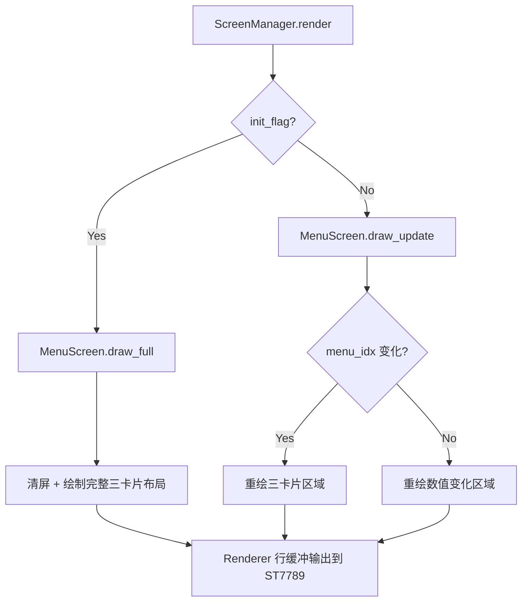
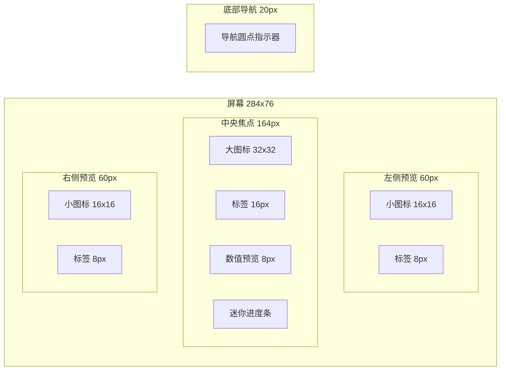

# 设计文档：菜单界面 UI 重新设计

## 概述

本设计针对 Pico Turbo 项目的菜单导航界面进行全面视觉重构。当前菜单采用居中大图标+底部导航点的简单布局，视觉层次单一、信息密度低、缺乏专业感。新设计采用「卡片式横向滚动」布局，在 284×76 像素的狭长屏幕上实现：选中项居中放大显示（含图标、标签、实时数值预览），左右两侧显示相邻项的缩略预览，底部保留导航指示器。通过合理的色彩层次、字体大小对比和胶囊进度条预览，打造专业、现代的嵌入式设备 UI。

所有实现基于现有 UI 框架（Renderer 行缓冲管线、位图字体引擎、4-bit 灰度 RLE 图标系统、Widget 库），不引入新的硬件依赖，内存开销控制在 RP2040 可用范围内。

## 架构

### 整体渲染流程



### 菜单界面布局架构



## 组件与接口

### 组件 1：MenuScreen（菜单界面主控）

**职责**：
- 管理菜单项选择状态和编码器输入
- 协调三卡片布局的绘制
- 管理图标资源的加载与释放
- 实现局部刷新优化

**接口**：
```python
class MenuScreen(Screen):
    def on_enter(self) -> None: ...      # 加载图标资源
    def on_input(self, event) -> None: ... # 处理旋转/点击
    def draw_full(self, r: Renderer) -> None: ...    # 完整绘制
    def draw_update(self, r: Renderer) -> None: ...  # 局部刷新
    def on_exit(self) -> None: ...       # 释放图标资源
```

### 组件 2：菜单项数据模型

**职责**：定义每个菜单项的显示属性和关联状态

```python
# (标签, 目标界面ID, 状态属性名, 后缀, 图标索引, 强调色)
MENU_ITEMS = [
    ("Speed",  UI_SPEED,  "fan_speed",   "%",  0, ACCENT),
    ("Smoke",  UI_SMOKE,  "smoke_speed", "%",  1, ORANGE),
    ("Pump",   UI_PUMP,   "pump_speed",  "%",  2, CYAN),
    ("Color",  UI_PRESET, "preset_idx",  "",   3, MAGENTA),
    ("RGB",    UI_RGB,    None,          "",   4, GREEN),
    ("Bright", UI_BRIGHT, "brightness",  "%",  5, YELLOW),
]
```

### 组件 3：新增 Widget 函数

**职责**：提供菜单专用的绘制控件

```python
def draw_menu_card_center(r, icon_sheet, item, value, y_offset=0):
    """绘制中央焦点卡片：大图标 + 16px标签 + 数值 + 迷你进度条"""
    ...

def draw_menu_card_side(r, icon_sheet, item, x, is_left=True):
    """绘制侧边预览卡片：小图标 + 8px标签，半透明效果"""
    ...

def draw_mini_bar(r, x, y, w, h, pct, fg, bg=DARK_GRAY):
    """迷你进度条（无圆角，纯矩形，节省计算）"""
    ...
```
