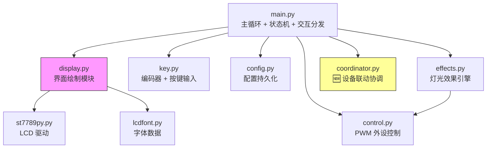
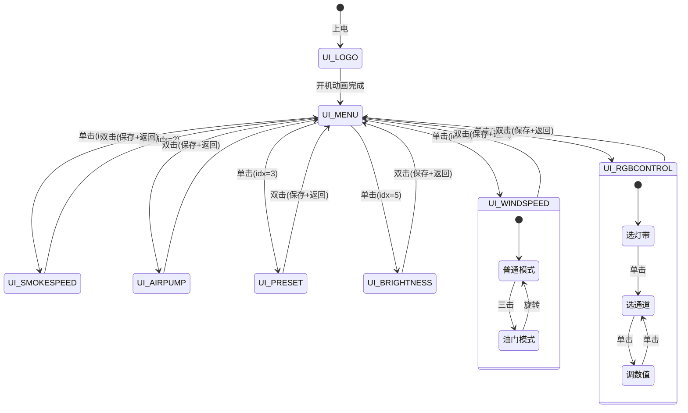
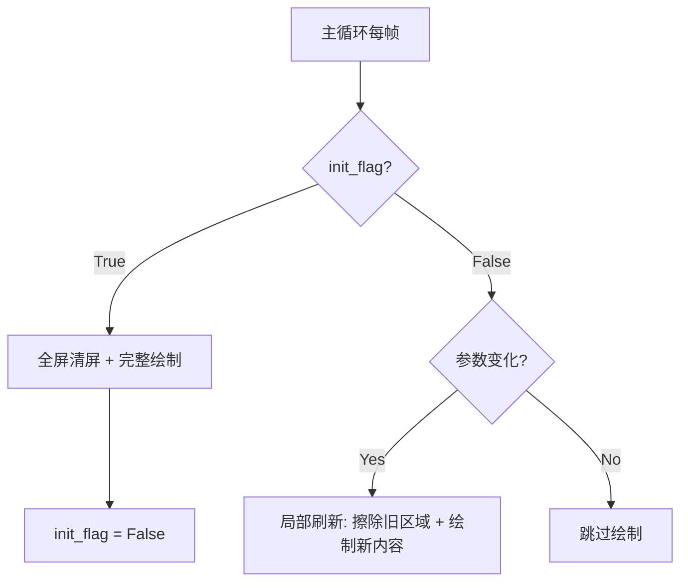

# 设计文档：Pico 功能复刻（UI + 菜单 + 外设控制）

## 概述

本设计文档描述如何在 Raspberry Pi Pico (MicroPython) 的 76×284 横屏上复刻 F4 RideWind 项目的 UI 视觉风格、菜单交互逻辑和外设控制体验。

核心设计理念：
- **参考而非照搬**：F4 使用 240×240 方屏 + 图片资源，Pico 使用 76×284 横屏 + 纯代码绘制，需要重新设计布局
- **局部刷新优先**：MicroPython 性能有限，全屏重绘会导致明显闪烁，采用 init_flag 控制全绘 + 脏区域局部更新
- **在现有基础上增强**：已有 display.py 的 8 个绘制函数和 main.py 的状态机框架，在此基础上优化

## 架构

### 模块架构图



### 界面状态机（复刻 F4 的 ui/chu 机制）



### 刷新策略架构



## 组件与接口

### display.py 增强设计

现有 display.py 已有 8 个 `draw_xxx_screen(tft, state)` 函数和基础绘图基元（`draw_rounded_bar`、`draw_gradient_bar`、`draw_solid_bar`、`draw_indicator_dot`、`draw_big_number`）。需要增强的部分：

#### 新增：局部刷新函数

每个界面增加 `update_xxx_screen(tft, state, old_state)` 函数，仅重绘变化的区域：

```python
def update_windspeed_screen(tft, state, old_state):
    """风速界面局部刷新：仅更新数字和进度条"""
    if state["fan_speed"] != old_state["fan_speed"]:
        _update_speed_number(tft, state["fan_speed"])
        _update_speed_bar(tft, state["fan_speed"], state.get("throttle_mode", False))
    if state.get("throttle_mode") != old_state.get("throttle_mode"):
        _update_throttle_indicator(tft, state["throttle_mode"])
```

#### 新增：菜单值预览

菜单界面选中项下方显示当前值：

```python
def _draw_menu_value_preview(tft, idx, state):
    """在菜单选中项下方显示当前值预览"""
    values = [
        "{}%".format(state["fan_speed"]),
        "{}%".format(state["smoke_speed"]),
        "{}%".format(state["air_pump_speed"]),
        COLOR_PRESETS[state["color_preset_idx"]]["name"],
        "COB{}".format(state["rgb_strip"] + 1),
        "{}%".format(state["brightness"]),
    ]
    text = values[idx]
    tx = (SW - len(text) * CW) // 2
    tft.text(font8x8, text, tx, 38, ACCENT, BG)
```

#### 新增：操作提示文字

所有子界面底部固定位置显示操作提示：

```python
def _draw_hint(tft, text="2x:Back"):
    """在界面底部显示操作提示"""
    tx = SW - len(text) * CW - 4
    tft.text(font8x8, text, tx, SH - 10, GRAY, BG)
```

### F4 → Pico 界面布局对照

| 元素 | F4 (240×240 方屏) | Pico (284×76 横屏) |
|------|-------------------|-------------------|
| 菜单 | 全屏单页，居中图标+文字+底部圆点 | 横向三项卡片：左灰-中高亮-右灰+底部圆点 |
| 速度数字 | 图片取模大数字（53px高），右对齐 | 3x 放大 font8x8（24px高），居中 |
| 进度条 | LCD_DrawRoundedBar 胶囊形 | draw_rounded_bar 胶囊形（已实现） |
| 预设色条 | LCD_DrawGradientBar/SolidBar 115×14 | draw_gradient_bar/solid_bar（已实现） |
| RGB 通道 | 图片取模 R/G/B 字母 + 数字 | 文字 R/G/B + 彩色进度条 + 数值 |
| 状态指示 | 红/绿圆点图片 (12×21) | Fill_Circle 实心圆点（已实现） |
| 单位/标签 | 图片取模 km/h, mph, BRT 等 | 8×8 字体文字 |

### coordinator.py 新模块设计

```python
# coordinator.py - 设备联动协调器

class DeviceCoordinator:
    def __init__(self, config):
        self.link_mode = config.get("link_mode", "auto")  # "auto" | "manual"
        self.fan_link_ratio = config.get("fan_link_ratio", 0.8)  # 小风扇跟随比例
        self.pump_delay_ms = 2000  # 气泵延迟关闭时间
        self._pump_off_tick = 0    # 气泵延迟关闭时间戳
        self._pump_pending_off = False

    def on_fan_speed_change(self, fan_speed, set_small_fan_fn):
        """主风扇变化时联动小风扇"""
        if self.link_mode == "auto":
            small_speed = int(fan_speed * self.fan_link_ratio)
            set_small_fan_fn(small_speed)

    def on_smoke_change(self, smoke_speed, set_air_pump_fn, current_tick):
        """发烟器变化时联动气泵"""
        if self.link_mode != "auto":
            return
        if smoke_speed > 0:
            set_air_pump_fn(min(100, smoke_speed + 20))
            self._pump_pending_off = False
        else:
            self._pump_pending_off = True
            self._pump_off_tick = current_tick

    def process(self, current_tick, set_air_pump_fn):
        """每帧调用，处理延迟任务"""
        if self._pump_pending_off:
            if current_tick - self._pump_off_tick >= self.pump_delay_ms:
                set_air_pump_fn(0)
                self._pump_pending_off = False
```

### main.py 增强设计

#### 局部刷新集成

```python
# 新增：上一帧状态缓存（用于局部刷新对比）
_prev_state = {}

def update_display():
    global init_flag, _prev_state
    state = get_state()

    if ui == UI_WINDSPEED:
        if init_flag:
            draw_windspeed_screen(tft, state)
            init_flag = False
        else:
            update_windspeed_screen(tft, state, _prev_state)

    # ... 其他界面类似

    _prev_state = state.copy()
```

#### 油门模式增强

```python
# 非线性加速曲线
if throttle_mode:
    if key_pin.value() == 0:  # 按住
        accel = 1 if fan_speed < 50 else 2
        fan_speed = min(100, fan_speed + accel)
    else:  # 松开
        fan_speed = max(0, fan_speed - 1)
```

### 接口定义汇总

| 模块 | 函数 | 参数 | 说明 |
|------|------|------|------|
| display | `draw_xxx_screen(tft, state)` | tft: ST7789, state: dict | 全屏绘制（init_flag=True 时） |
| display | `update_xxx_screen(tft, state, old_state)` | 同上 + old_state | 局部刷新（参数变化时） |
| display | `_draw_hint(tft, text)` | tft, 提示文字 | 底部操作提示 |
| coordinator | `DeviceCoordinator(config)` | config dict | 初始化联动器 |
| coordinator | `.on_fan_speed_change(speed, fn)` | 速度, 回调 | 风扇联动 |
| coordinator | `.on_smoke_change(speed, fn, tick)` | 速度, 回调, 时间戳 | 发烟联动 |
| coordinator | `.process(tick, fn)` | 时间戳, 回调 | 每帧处理 |

## 数据模型

### 状态字典 (state dict)

```python
state = {
    # 菜单
    "current_mode_idx": 0,      # int 0-5, 菜单选中项
    # 速度控制
    "fan_speed": 0,             # int 0-100
    "smoke_speed": 0,           # int 0-100
    "air_pump_speed": 0,        # int 0-100
    "throttle_mode": False,     # bool
    # 灯光
    "brightness": 100,          # int 0-100
    "breath_mode": False,       # bool
    "color_preset_idx": 0,      # int 0-11
    "gradient_mode": False,     # bool
    "cob1_rgb": [0, 0, 0],     # list[int] 0-255
    "cob2_rgb": [0, 0, 0],     # list[int] 0-255
    # RGB 调色
    "rgb_mode": 0,              # int 0-2 (选灯带/选通道/调数值)
    "rgb_strip": 0,             # int 0-1 (COB1/COB2)
    "rgb_channel": 0,           # int 0-2 (R/G/B)
}
```

### 配置持久化模型 (settings.json)

```json
{
    "fan_speed": 0,
    "smoke_speed": 0,
    "air_pump_speed": 0,
    "cob1_rgb": [0, 0, 0],
    "cob2_rgb": [0, 0, 0],
    "brightness": 100,
    "color_preset": 0,
    "led_mode": "normal",
    "link_mode": "auto",
    "fan_link_ratio": 0.8
}
```

### 界面布局常量

```python
# 76×284 横屏布局参数
SW = 284    # 屏幕宽度
SH = 76     # 屏幕高度
CW = 8      # 字符宽度
CH = 8      # 字符高度

# 速度界面布局
SPEED_NUM_CX = SW // 2     # 大数字中心 X
SPEED_NUM_CY = 28          # 大数字中心 Y
SPEED_BAR_X = 20           # 进度条起始 X
SPEED_BAR_Y = SH - 20      # 进度条 Y
SPEED_BAR_W = SW - 40      # 进度条宽度
SPEED_BAR_H = 10           # 进度条高度

# 菜单界面布局
MENU_DOT_Y = SH - 12       # 导航点 Y
MENU_DOT_R = 2             # 导航点半径
MENU_DOT_GAP = 10          # 导航点间距

# RGB 界面布局
RGB_BAR_X = 28             # RGB 通道条起始 X
RGB_BAR_W = 180            # RGB 通道条宽度
RGB_BAR_H = 8              # RGB 通道条高度
RGB_ROW_SPACING = 20       # RGB 行间距
```

## 正确性属性

*正确性属性是一种在系统所有有效执行中都应成立的特征或行为——本质上是关于系统应该做什么的形式化陈述。属性是人类可读规范与机器可验证正确性保证之间的桥梁。*

### Property 1: 菜单防跳间隔有效性
*For any* 编码器事件序列，如果两次事件的时间间隔小于 150ms，则菜单选中项索引最多只变化一次。
**Validates: Requirements 1.2**

### Property 2: 菜单值预览与状态一致性
*For any* 菜单选中项索引 (0-5) 和任意状态字典，显示的值预览文字应与状态字典中对应参数的实际值匹配。
**Validates: Requirements 1.3**

### Property 3: 菜单进入-返回往返一致性
*For any* 菜单选中项索引，单击进入子界面后双击返回菜单，菜单选中项索引应与进入前相同。
**Validates: Requirements 1.5, 1.6**

### Property 4: 局部刷新策略正确性
*For any* 界面状态，当 init_flag 为 False 且仅部分参数变化时，系统应调用局部更新函数而非全屏绘制函数。
**Validates: Requirements 2.3, 5.4, 7.1, 7.2, 7.4**

### Property 5: 预设编号与名称映射正确性
*For any* 预设索引 (0-11)，显示的编号应为 "索引+1/12"，名称应与 COLOR_PRESETS[索引]["name"] 完全匹配。
**Validates: Requirements 3.1**

### Property 6: 纯色/渐变条选择正确性
*For any* 颜色预设，当 cob1 颜色等于 cob2 颜色时应使用纯色条绘制，否则应使用渐变条绘制。
**Validates: Requirements 3.3**

### Property 7: 预设切换环绕正确性
*For any* 当前预设索引和编码器增量，新索引应等于 (当前索引 + 增量) % 12，且 COB 灯带输出颜色应与新预设的颜色定义匹配。
**Validates: Requirements 3.6**

### Property 8: RGB 数值调节范围约束
*For any* 当前 RGB 通道值 (0-255) 和编码器增量，调节后的值应等于 clamp(当前值 + 增量 * 2, 0, 255)。
**Validates: Requirements 4.5**

### Property 9: RGB 状态机模式转换正确性
*For any* 当前 rgb_mode 值，单击后的新 rgb_mode 应遵循：0→1, 1→2, 2→1 的转换规则。
**Validates: Requirements 4.6**

### Property 10: 油门模式非线性加速曲线
*For any* 当前风扇速度，油门模式按住时的加速增量应为：速度 < 50 时 +1，速度 >= 50 时 +2。
**Validates: Requirements 8.1**

### Property 11: 油门模式线性减速
*For any* 当前风扇速度 > 0，油门模式松开时速度应减少 1。
**Validates: Requirements 8.2**

### Property 12: 油门模式旋转退出
*For any* 处于油门模式的状态，当编码器增量不为 0 时，油门模式应被关闭。
**Validates: Requirements 8.3**

### Property 13: 风扇速度范围不变量
*For any* 操作序列（包括油门模式加速、减速、普通调速），风扇速度始终在 [0, 100] 范围内。
**Validates: Requirements 8.4**

### Property 14: 设备联动比例正确性
*For any* 主风扇速度和联动比例，当联动模式为 "auto" 时，小风扇速度应等于 int(主风扇速度 * 联动比例)。
**Validates: Requirements 9.1**

### Property 15: 发烟-气泵联动正确性
*For any* 发烟器速度从 0 变为正值，气泵应被自动启动；发烟器速度变为 0 后 2000ms，气泵应被关闭。
**Validates: Requirements 9.2, 9.3**

### Property 16: 手动模式独立控制
*For any* 联动模式为 "manual" 时，改变主风扇速度不应影响小风扇速度。
**Validates: Requirements 9.4**

### Property 17: 配置加载健壮性
*For any* 配置文件内容（有效、无效、缺失），load_config 返回的每个配置值都应在有效范围内。
**Validates: Requirements 10.2, 10.5**

### Property 18: 脏标志写入优化
*For any* 配置操作序列，如果没有调用 config.set()，则 save_config() 不应写入文件系统。
**Validates: Requirements 10.4**

## 错误处理

| 错误场景 | 处理策略 | 涉及模块 |
|---------|---------|---------|
| 配置文件损坏/缺失 | 使用 DEFAULT_CONFIG，串口输出警告 | config.py |
| 配置值超出范围 | 替换为默认值，继续运行 | config.py |
| 主循环异常 | try/except 捕获，stop_all_devices()，串口输出错误 | main.py |
| 编码器中断竞争 | 原子读取 + 清零（get_encoder_delta） | key.py |
| LCD SPI 通信失败 | 无法恢复，串口输出错误 | st7789py.py |
| 联动定时器溢出 | utime.ticks_diff 处理溢出 | coordinator.py |

### 配置值范围校验规则

```python
CONFIG_VALIDATORS = {
    "fan_speed": (0, 100),
    "smoke_speed": (0, 100),
    "air_pump_speed": (0, 100),
    "brightness": (0, 100),
    "color_preset": (0, 11),
    "cob1_rgb": lambda v: isinstance(v, list) and len(v) == 3 and all(0 <= x <= 255 for x in v),
    "cob2_rgb": lambda v: isinstance(v, list) and len(v) == 3 and all(0 <= x <= 255 for x in v),
    "led_mode": lambda v: v in ("normal", "breathing", "gradient"),
    "link_mode": lambda v: v in ("auto", "manual"),
    "fan_link_ratio": (0.0, 1.0),
}
```

## 测试策略

### 测试框架

- **单元测试**：使用 Python 标准 `unittest` 模块（MicroPython 兼容）
- **属性基测试**：使用 `hypothesis` 库（在开发机上运行，非 Pico 上）
- 每个属性测试最少运行 100 次迭代

### 双重测试方法

**单元测试**（具体示例和边界情况）：
- 菜单索引边界：idx=0 左移、idx=5 右移
- RGB 值边界：0 减小、255 增大
- 油门模式边界：speed=0 减速、speed=100 加速
- 配置文件：空文件、损坏 JSON、缺失字段
- 联动模式切换：auto→manual→auto

**属性基测试**（通用属性验证）：
- 使用 `hypothesis` 生成随机状态和操作序列
- 每个正确性属性对应一个属性测试
- 标签格式：**Feature: pico-full-port, Property N: 属性名称**

### 测试文件组织

```
test_display_logic.py    # 测试 display.py 的逻辑（非视觉）
test_coordinator.py      # 测试 coordinator.py 联动逻辑
test_state_machine.py    # 测试界面状态机转换
test_throttle.py         # 测试油门模式逻辑
test_config.py           # 测试配置持久化（已有，需扩展）
```

### 属性测试示例

```python
from hypothesis import given, strategies as st

# Feature: pico-full-port, Property 13: 风扇速度范围不变量
@given(
    initial_speed=st.integers(min_value=0, max_value=100),
    operations=st.lists(
        st.tuples(
            st.sampled_from(["throttle_accel", "throttle_decel", "encoder"]),
            st.integers(min_value=-10, max_value=10)
        ),
        min_size=1, max_size=50
    )
)
def test_fan_speed_invariant(initial_speed, operations):
    speed = initial_speed
    for op, delta in operations:
        if op == "throttle_accel":
            accel = 1 if speed < 50 else 2
            speed = min(100, speed + accel)
        elif op == "throttle_decel":
            speed = max(0, speed - 1)
        elif op == "encoder":
            speed = max(0, min(100, speed + delta))
    assert 0 <= speed <= 100
```
