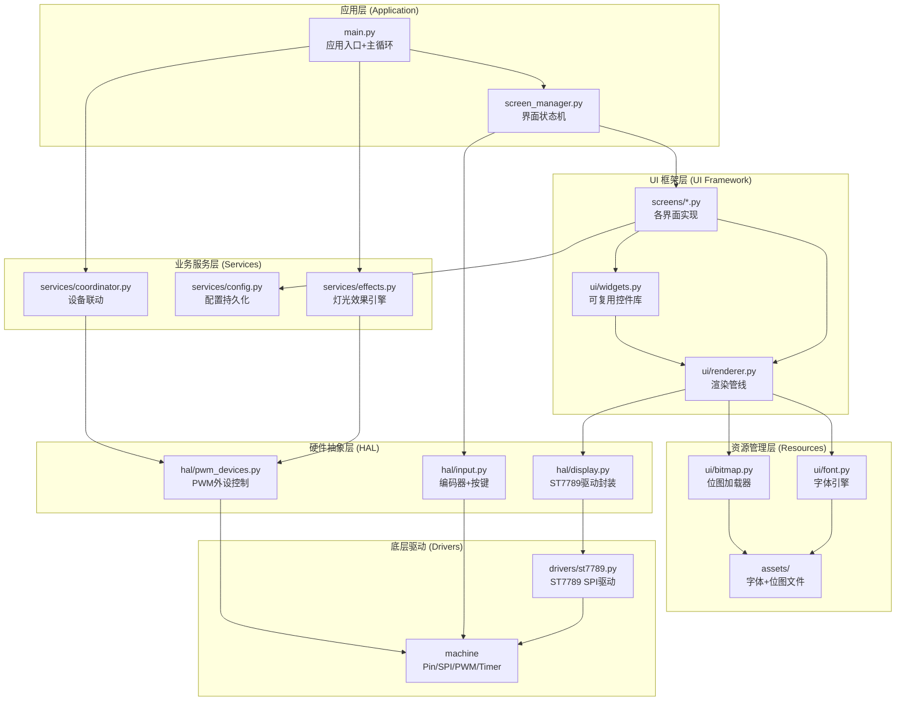
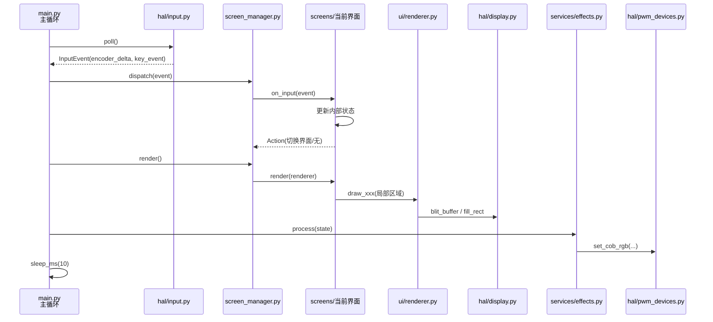

# 设计文档: Pico Turbo 全面重构

## 概述

本设计文档定义了 Pico Turbo 嵌入式项目的完整架构重构方案。目标平台为 Raspberry Pi Pico (RP2040) + MicroPython，屏幕为 ST7789 76×284 横屏，输入为 EC10 旋转编码器。设计对标 F4 参考项目（STM32F405 + 240×240 圆屏），在 RP2040 有限资源（264KB RAM、2MB Flash）下实现专业级 UI 和完整的外设控制系统。

核心设计理念：分层解耦、资源预算驱动、局部刷新优先、内存池化管理。推翻现有单文件堆砌的粗糙实现，建立清晰的模块边界和数据流。

## 系统架构

### 整体分层架构



### 数据流序列图（主循环一帧）



## 组件和接口

### 组件 1: 项目文件结构

```
pico-turbo/
├── main.py                    # 应用入口：硬件初始化 + 主循环
├── screen_manager.py          # 界面状态机：ui/init_flag + 事件分发
│
├── hal/                       # 硬件抽象层
│   ├── __init__.py
│   ├── display.py             # ST7789 封装：framebuffer 管理 + 刷新接口
│   ├── input.py               # EC10 编码器：旋转中断 + 按键状态机
│   └── pwm_devices.py         # PWM 外设：风扇/气泵/发烟器/COB灯带
│
├── ui/                        # UI 框架
│   ├── __init__.py
│   ├── renderer.py            # 渲染管线：脏区管理 + 批量提交
│   ├── widgets.py             # 控件库：进度条/大数字/指示点/图标
│   ├── font.py                # 字体引擎：多尺寸字体加载和渲染
│   ├── bitmap.py              # 位图加载器：从文件读取 RGB565 位图
│   └── theme.py               # 主题常量：颜色/间距/布局参数
│
├── screens/                   # 各界面实现（每个界面一个文件）
│   ├── __init__.py
│   ├── boot.py                # UI0: 开机动画
│   ├── menu.py                # UI1: 菜单导航
│   ├── speed.py               # UI2: 风速控制（含油门模式）
│   ├── smoke.py               # UI3: 发烟控制
│   ├── pump.py                # UI4: 气泵控制
│   ├── preset.py              # UI5: 灯光预设
│   ├── rgb.py                 # UI6: RGB 调色（三层状态机）
│   └── brightness.py          # UI7: 亮度调节
│
├── services/                  # 业务服务
│   ├── __init__.py
│   ├── effects.py             # 灯光效果引擎：呼吸灯/渐变
│   ├── config.py              # 配置持久化：JSON + 脏标志
│   └── coordinator.py         # 设备联动：风扇联动/气泵延迟
│
├── drivers/                   # 底层驱动
│   ├── __init__.py
│   └── st7789.py              # ST7789 SPI 驱动（精简版）
│
└── assets/                    # 资源文件（存储在 Pico Flash 文件系统）
    ├── font_16.bin            # 16px 主字体（数字+常用ASCII）
    ├── font_32.bin            # 32px 大数字字体（0-9 + % + . ）
    ├── icons_24.bin           # 24×24 菜单图标集（6个图标打包）
    └── logo.bin               # 开机 Logo 位图
```

### 组件 2: hal/display.py — 显示硬件抽象

**职责**: 封装 ST7789 驱动，提供 framebuffer 管理和高效刷新接口。

```python
# hal/display.py
from drivers.st7789 import ST7789
from machine import Pin, SPI

class Display:
    """ST7789 显示封装，管理 SPI 总线和局部刷新"""
    
    WIDTH = 284
    HEIGHT = 76
    
    def __init__(self):
        """初始化 SPI 和 ST7789 驱动"""
        ...
    
    def fill(self, color: int) -> None:
        """全屏填充"""
        ...
    
    def fill_rect(self, x: int, y: int, w: int, h: int, color: int) -> None:
        """矩形填充"""
        ...
    
    def blit(self, buf: bytearray, x: int, y: int, w: int, h: int) -> None:
        """将 RGB565 缓冲区写入指定区域（核心刷新接口）"""
        ...
    
    def hline(self, x: int, y: int, w: int, color: int) -> None:
        ...
    
    def vline(self, x: int, y: int, h: int, color: int) -> None:
        ...
    
    def pixel(self, x: int, y: int, color: int) -> None:
        ...
```

### 组件 3: hal/input.py — 输入设备抽象

**职责**: 封装 EC10 编码器的旋转检测和按键状态机，提供统一的事件接口。

```python
# hal/input.py
from machine import Pin, Timer

# 事件类型常量
EVT_NONE = 0
EVT_CLICK = 1
EVT_DOUBLE = 2
EVT_TRIPLE = 3
EVT_LONG = 4

class InputEvent:
    """输入事件数据"""
    __slots__ = ('delta', 'key')
    
    def __init__(self):
        self.delta = 0    # 编码器增量
        self.key = EVT_NONE  # 按键事件

class Input:
    """EC10 编码器输入管理"""
    
    def __init__(self, key_pin=19, a_pin=20, b_pin=21):
        """初始化编码器引脚和中断"""
        ...
    
    def poll(self) -> InputEvent:
        """读取并清除累积的输入事件（每帧调用一次）
        
        前置条件: 中断已注册
        后置条件: 内部计数器清零，返回本帧累积事件
        """
        ...
    
    def raw_key_pressed(self) -> bool:
        """直接读取按键物理状态（油门模式用）"""
        ...
```

### 组件 4: hal/pwm_devices.py — PWM 外设控制

**职责**: 统一管理所有 PWM 外设，提供百分比接口。

```python
# hal/pwm_devices.py
from machine import Pin, PWM

class PwmDevices:
    """所有 PWM 外设的统一管理"""
    
    def __init__(self):
        """初始化所有 PWM 通道，频率 1kHz，占空比 0"""
        ...
    
    def set_fan(self, pct: int) -> None:
        """主风扇 GPIO6, 0-100%"""
        ...
    
    def set_small_fan(self, pct: int) -> None:
        """小风扇 GPIO10, 0-100%"""
        ...
    
    def set_pump(self, pct: int) -> None:
        """气泵 GPIO11, 0-100%"""
        ...
    
    def set_smoke(self, pct: int) -> None:
        """发烟器 GPIO12, 0-100%"""
        ...
    
    def set_cob1(self, r: int, g: int, b: int) -> None:
        """COB1 灯带 GPIO13/14/15, RGB 各 0-255"""
        ...
    
    def set_cob2(self, r: int, g: int, b: int) -> None:
        """COB2 灯带 GPIO7/8/9, RGB 各 0-255"""
        ...
    
    def stop_all(self) -> None:
        """紧急停止所有外设"""
        ...
```

### 组件 5: screen_manager.py — 界面状态机

**职责**: 管理界面切换、事件分发、init_flag 机制（对标 F4 的 ui/chu 双变量）。

```python
# screen_manager.py

# 界面 ID 常量
UI_BOOT = 0
UI_MENU = 1
UI_SPEED = 2
UI_SMOKE = 3
UI_PUMP = 4
UI_PRESET = 5
UI_RGB = 6
UI_BRIGHT = 7

class ScreenManager:
    """界面状态机（F4 风格 ui/init_flag 双变量机制）"""
    
    def __init__(self, renderer, devices, config):
        """
        前置条件: renderer, devices, config 已初始化
        后置条件: 所有 Screen 实例已创建，当前界面为 UI_BOOT
        """
        self._screens = {}   # {ui_id: Screen}
        self._current = UI_BOOT
        self._init_flag = True
        self._renderer = renderer
        ...
    
    def switch(self, ui_id: int) -> None:
        """切换界面
        
        前置条件: ui_id 在 UI_BOOT..UI_BRIGHT 范围内
        后置条件: _current = ui_id, _init_flag = True
        """
        ...
    
    def dispatch(self, event: 'InputEvent') -> None:
        """将输入事件分发给当前界面
        
        前置条件: event 是有效的 InputEvent
        后置条件: 当前界面状态已更新
        """
        ...
    
    def render(self) -> None:
        """渲染当前界面
        
        如果 _init_flag=True: 调用 screen.draw_full()，然后重置
        否则: 调用 screen.draw_update()
        """
        ...
    
    @property
    def current_ui(self) -> int:
        """当前界面 ID"""
        ...
```

### 组件 6: Screen 基类和界面协议

**职责**: 定义所有界面的统一接口。

```python
# screens/__init__.py

class Screen:
    """界面基类，所有 screens/*.py 继承此类"""
    
    def __init__(self, ctx):
        """
        ctx: 共享上下文对象，包含 renderer, devices, config, screen_manager
        """
        self.ctx = ctx
    
    def on_enter(self) -> None:
        """进入界面时调用（init_flag 触发前）"""
        pass
    
    def on_input(self, event: 'InputEvent') -> None:
        """处理输入事件
        
        前置条件: event.delta 和 event.key 已填充
        后置条件: 内部状态已更新，可能触发 ctx.screen_manager.switch()
        """
        pass
    
    def draw_full(self, r: 'Renderer') -> None:
        """完整绘制（清屏 + 所有元素）
        
        前置条件: 屏幕已清空或即将清空
        后置条件: 界面所有视觉元素已绘制
        """
        pass
    
    def draw_update(self, r: 'Renderer') -> None:
        """局部刷新（仅更新变化的区域）
        
        前置条件: draw_full 已至少执行过一次
        后置条件: 仅变化的区域被重绘
        """
        pass
    
    def on_exit(self) -> None:
        """离开界面时调用"""
        pass
```

## 数据模型

### Model 1: AppState — 全局应用状态

```python
# 全局状态结构（替代现有的散落全局变量）
class AppState:
    """应用全局状态，所有界面共享读写"""
    __slots__ = (
        'fan_speed', 'smoke_speed', 'pump_speed',
        'cob1_rgb', 'cob2_rgb',
        'brightness', 'breath_mode',
        'preset_idx', 'gradient_mode',
        'throttle_mode',
        'rgb_mode', 'rgb_strip', 'rgb_channel',
        'menu_idx',
    )
    
    def __init__(self):
        self.fan_speed = 0        # 0-100
        self.smoke_speed = 0      # 0-100
        self.pump_speed = 0       # 0-100
        self.cob1_rgb = [0, 0, 0] # 各 0-255
        self.cob2_rgb = [0, 0, 0] # 各 0-255
        self.brightness = 100     # 0-100
        self.breath_mode = False
        self.preset_idx = 0       # 0-11
        self.gradient_mode = False
        self.throttle_mode = False
        self.rgb_mode = 0         # 0=选灯带, 1=选通道, 2=调数值
        self.rgb_strip = 0        # 0=COB1, 1=COB2
        self.rgb_channel = 0      # 0=R, 1=G, 2=B
        self.menu_idx = 0         # 0-5 菜单选中项
```

**校验规则**:
- fan_speed, smoke_speed, pump_speed: 整数 [0, 100]
- cob1_rgb, cob2_rgb: 三元素列表，各元素 [0, 255]
- brightness: 整数 [0, 100]
- preset_idx: 整数 [0, 11]
- rgb_mode: 整数 {0, 1, 2}
- rgb_strip: 整数 {0, 1}
- rgb_channel: 整数 {0, 1, 2}
- menu_idx: 整数 [0, 5]

### Model 2: 配置持久化结构

```python
# services/config.py
DEFAULT_CONFIG = {
    "fan_speed": 0,
    "smoke_speed": 0,
    "pump_speed": 0,
    "cob1_rgb": [0, 0, 0],
    "cob2_rgb": [0, 0, 0],
    "brightness": 100,
    "preset_idx": 0,
    "led_mode": "normal",      # "normal" | "breathing" | "gradient"
    "link_mode": "auto",       # "auto" | "manual"
    "fan_link_ratio": 0.8,     # 0.0-1.0
}
```

### Model 3: 颜色预设表

```python
# ui/theme.py 中定义
PRESETS = [
    ("Cyber",   (138,43,226),  (0,255,128)),
    ("Ice",     (0,234,255),   (0,234,255)),
    ("Sunset",  (255,100,0),   (0,200,255)),
    ("Racing",  (255,210,0),   (255,210,0)),
    ("Flame",   (255,0,0),     (255,0,0)),
    ("Police",  (255,0,0),     (0,80,255)),
    ("Sakura",  (255,105,180), (255,0,80)),
    ("Aurora",  (180,0,255),   (0,255,200)),
    ("Violet",  (148,0,211),   (148,0,211)),
    ("Mint",    (0,255,180),   (100,200,255)),
    ("Jungle",  (0,255,65),    (0,255,65)),
    ("White",   (225,225,225), (225,225,225)),
]
# 元组格式节省内存：(name, cob1_rgb, cob2_rgb)
```

## UI 渲染管线设计

### 渲染策略：行缓冲 + 脏区追踪

RP2040 的 264KB RAM 无法容纳全屏 framebuffer（284×76×2 = 43,168 字节），但可以分配行缓冲。

```python
# ui/renderer.py

class Renderer:
    """渲染管线：行缓冲 + 脏区批量提交"""
    
    # 行缓冲大小：284 像素 × 2 字节/像素 × N 行
    # 8 行缓冲 = 284 × 8 × 2 = 4,544 字节（可接受）
    LINE_BUF_ROWS = 8
    
    def __init__(self, display: 'Display'):
        self._display = display
        self._buf = bytearray(284 * self.LINE_BUF_ROWS * 2)
        self._dirty_regions = []  # [(x, y, w, h), ...]
    
    def clear(self, color: int = 0x0000) -> None:
        """全屏清除"""
        self._display.fill(color)
        self._dirty_regions.clear()
    
    def fill_rect(self, x: int, y: int, w: int, h: int, color: int) -> None:
        """填充矩形（直接写屏，不经过缓冲）"""
        self._display.fill_rect(x, y, w, h, color)
    
    def blit_bitmap(self, data: memoryview, x: int, y: int, w: int, h: int) -> None:
        """将 RGB565 位图数据写入屏幕指定区域"""
        self._display.blit(data, x, y, w, h)
    
    def draw_text(self, font: 'Font', text: str, x: int, y: int,
                  fg: int, bg: int = 0x0000) -> int:
        """使用指定字体绘制文本，返回绘制宽度
        
        前置条件: font 已加载，x/y 在屏幕范围内
        后置条件: 文本已渲染到屏幕
        """
        ...
    
    def draw_number(self, value: int, cx: int, cy: int,
                    font: 'Font', fg: int, bg: int = 0x0000) -> None:
        """居中绘制数字（大数字显示专用）
        
        前置条件: font 是数字专用字体
        后置条件: 数字居中绘制在 (cx, cy)
        """
        ...
    
    def draw_hbar(self, x: int, y: int, w: int, h: int,
                  pct: int, fg: int, bg: int) -> None:
        """绘制水平进度条（圆角胶囊形）
        
        前置条件: 0 <= pct <= 100
        后置条件: 进度条已绘制，前景宽度 = w * pct / 100
        """
        ...
    
    def draw_gradient_bar(self, x: int, y: int, w: int, h: int,
                          c1: tuple, c2: tuple) -> None:
        """绘制渐变色条（RGB888 元组输入）"""
        ...
    
    def draw_dot(self, cx: int, cy: int, r: int, color: int) -> None:
        """绘制实心圆点"""
        ...
```

### 字体系统设计

**方案**: 使用预渲染的位图字体文件（.bin），支持多尺寸。

```python
# ui/font.py

class Font:
    """位图字体加载器
    
    字体文件格式 (.bin):
    - Header (4 bytes): width(1B) + height(1B) + first_char(1B) + char_count(1B)
    - Glyph data: 每个字符 = width * ceil(height/8) 字节（列优先位图）
    
    生成工具: 使用 PC 端 Python 脚本从 TTF 生成 .bin
    """
    
    def __init__(self, path: str):
        """从文件加载字体
        
        前置条件: path 指向有效的 .bin 字体文件
        后置条件: 字体元数据和字形数据已加载到内存
        """
        self.width = 0
        self.height = 0
        self._first = 0
        self._count = 0
        self._data = None  # bytearray 或 memoryview
        self._load(path)
    
    def _load(self, path: str) -> None:
        """加载字体文件到内存"""
        ...
    
    def get_glyph(self, ch: str) -> memoryview:
        """获取单个字符的字形数据
        
        前置条件: ord(ch) 在 [_first, _first+_count) 范围内
        后置条件: 返回该字符的位图数据视图
        """
        ...
    
    def text_width(self, text: str) -> int:
        """计算文本像素宽度"""
        return len(text) * self.width


# 字体实例（延迟加载，按需创建）
_font_cache = {}

def get_font(size: int) -> Font:
    """获取指定尺寸的字体（带缓存）
    
    支持尺寸: 8（内置）, 16, 32
    """
    if size not in _font_cache:
        if size == 8:
            _font_cache[8] = _create_builtin_8px()
        else:
            _font_cache[size] = Font(f"assets/font_{size}.bin")
    return _font_cache[size]
```

**字体生成工具**（PC 端运行，不烧录到 Pico）:

```python
# tools/font_gen.py（在 PC 上运行）
# 从 TTF 字体生成 .bin 位图字体文件
# 依赖: PIL/Pillow
#
# 用法: python tools/font_gen.py --ttf=font.ttf --size=16 --chars="0123456789%" --out=assets/font_16.bin
#
# 推荐字体:
# - 数字显示: "DSEG7 Classic"（七段数码管风格）或 "Orbitron"（科技感）
# - 通用文本: "Roboto Condensed"（紧凑清晰）
# - 中文（如需）: "WenQuanYi Micro Hei"（文泉驿微米黑，子集化）
```

### 位图资源系统

```python
# ui/bitmap.py

class Bitmap:
    """RGB565 位图加载器
    
    文件格式 (.bin):
    - Header (4 bytes): width(2B LE) + height(2B LE)
    - Pixel data: width * height * 2 字节 (RGB565, big-endian)
    
    对标 F4 的 pic.h 预制位图，但改为文件存储以节省 RAM。
    """
    
    def __init__(self, path: str):
        """加载位图文件
        
        前置条件: path 指向有效的 .bin 位图文件
        后置条件: width, height 已解析，data 指向文件数据
        """
        self.width = 0
        self.height = 0
        self._data = None
        self._load(path)
    
    def _load(self, path: str) -> None:
        """加载位图：读取头部 + 像素数据"""
        ...
    
    def blit_to(self, renderer: 'Renderer', x: int, y: int) -> None:
        """将位图绘制到屏幕指定位置"""
        renderer.blit_bitmap(self._data, x, y, self.width, self.height)


class IconSheet:
    """图标集：多个等尺寸图标打包在一个文件中
    
    文件格式:
    - Header (6 bytes): icon_w(2B) + icon_h(2B) + count(2B)
    - Icons: count × (icon_w × icon_h × 2) 字节
    """
    
    def __init__(self, path: str):
        self.icon_w = 0
        self.icon_h = 0
        self.count = 0
        self._data = None
        self._load(path)
    
    def blit_icon(self, renderer: 'Renderer', index: int, x: int, y: int) -> None:
        """绘制指定索引的图标"""
        ...
```

**位图生成工具**（PC 端运行）:

```python
# tools/bitmap_gen.py（在 PC 上运行）
# 将 PNG/SVG 图片转换为 RGB565 .bin 文件
# 依赖: PIL/Pillow
#
# 用法:
#   单图: python tools/bitmap_gen.py --input=logo.png --out=assets/logo.bin
#   图标集: python tools/bitmap_gen.py --icons=icons/ --size=24 --out=assets/icons_24.bin
```

## 关键函数的形式化规约

### 函数 1: main() — 主循环

```python
def main():
    """应用入口：初始化 → 开机动画 → 主循环"""
    ...
```

**前置条件:**
- RP2040 硬件正常，SPI/GPIO 可用
- Flash 文件系统已挂载

**后置条件:**
- 所有硬件模块已初始化
- 主循环持续运行直到异常或中断

**循环不变量:**
- 每帧执行顺序: poll → dispatch → render → effects → sleep
- 帧间隔 ≈ 10ms（100fps 上限）

### 函数 2: ScreenManager.dispatch() — 事件分发

```python
def dispatch(self, event: InputEvent) -> None:
    """将输入事件分发给当前界面"""
    ...
```

**前置条件:**
- event.delta 是整数（可为 0）
- event.key 是 EVT_NONE..EVT_LONG 之一
- self._current 指向有效界面

**后置条件:**
- 当前界面的 on_input() 已被调用
- 如果界面请求切换，self._current 和 self._init_flag 已更新

### 函数 3: Renderer.draw_hbar() — 进度条绘制

```python
def draw_hbar(self, x, y, w, h, pct, fg, bg) -> None:
    """绘制圆角胶囊进度条"""
    ...
```

**前置条件:**
- 0 <= pct <= 100
- w > h >= 4（宽度大于高度，高度至少 4px）
- x, y 在屏幕范围内

**后置条件:**
- 背景条（bg 色）覆盖 (x, y, w, h) 区域
- 前景条（fg 色）覆盖 (x, y, w*pct/100, h) 区域
- 两端为半圆形

### 函数 4: Font.get_glyph() — 字形获取

```python
def get_glyph(self, ch: str) -> memoryview:
    """获取字符的位图数据"""
    ...
```

**前置条件:**
- ch 是单个字符
- ord(ch) >= self._first
- ord(ch) < self._first + self._count

**后置条件:**
- 返回长度为 width * ceil(height/8) 的 memoryview
- 数据格式为列优先位图（与 font8x8 兼容）

## 算法伪代码

### 主循环算法

```python
# main.py 主循环核心逻辑

def main():
    # ── 第 1 步：硬件初始化 ──
    devices = PwmDevices()
    devices.stop_all()
    display = Display()
    inp = Input()
    
    # ── 第 2 步：服务初始化 ──
    config = Config()
    state = config.load_to_state(AppState())
    effects = Effects(devices)
    coordinator = Coordinator(config, devices)
    
    # ── 第 3 步：UI 初始化 ──
    renderer = Renderer(display)
    ctx = Context(renderer, devices, config, state, effects, coordinator)
    sm = ScreenManager(ctx)
    
    # ── 第 4 步：开机动画 ──
    sm.switch(UI_BOOT)
    sm.render()
    effects.startup_animation()
    
    # ── 第 5 步：进入菜单 ──
    sm.switch(UI_MENU)
    
    # ── 第 6 步：主循环 ──
    while True:
        # 6.1 读取输入
        event = inp.poll()
        
        # 6.2 事件分发
        sm.dispatch(event)
        
        # 6.3 渲染
        sm.render()
        
        # 6.4 灯光效果（RGB 调色界面除外）
        if sm.current_ui != UI_RGB:
            effects.process(state)
        
        # 6.5 设备联动
        coordinator.process()
        
        # 6.6 帧间隔
        sleep_ms(10)
```

### 界面切换算法

```python
# screen_manager.py 界面切换核心逻辑

def switch(self, ui_id):
    """
    前置条件: ui_id 在 [UI_BOOT, UI_BRIGHT] 范围内
    后置条件: 旧界面 on_exit() 已调用，新界面 on_enter() 已调用
    不变量: _screens 字典不变
    """
    # 1. 通知旧界面退出
    if self._current in self._screens:
        self._screens[self._current].on_exit()
    
    # 2. 切换状态
    self._current = ui_id
    self._init_flag = True
    
    # 3. 通知新界面进入
    if ui_id in self._screens:
        self._screens[ui_id].on_enter()

def render(self):
    """
    前置条件: _current 指向有效界面
    后置条件: 屏幕内容已更新
    不变量: _init_flag 在 draw_full 后重置为 False
    """
    screen = self._screens[self._current]
    r = self._renderer
    
    if self._init_flag:
        r.clear()
        screen.draw_full(r)
        self._init_flag = False
    else:
        screen.draw_update(r)
```

### 油门模式算法（风速界面）

```python
# screens/speed.py 油门模式核心逻辑

def on_input(self, event):
    state = self.ctx.state
    
    if state.throttle_mode:
        # 油门模式：旋转退出
        if event.delta != 0:
            state.throttle_mode = False
            state.fan_speed = clamp(state.fan_speed + event.delta, 0, 100)
            self._sync_fan()
            return
        
        # 油门模式核心：按住加速，松开减速
        if self.ctx.input.raw_key_pressed():
            # 非线性加速：< 50 时 +1/帧，>= 50 时 +2/帧
            accel = 1 if state.fan_speed < 50 else 2
            state.fan_speed = min(100, state.fan_speed + accel)
        else:
            state.fan_speed = max(0, state.fan_speed - 1)
        self._sync_fan()
    else:
        # 普通模式
        if event.delta != 0:
            state.fan_speed = clamp(state.fan_speed + event.delta, 0, 100)
            self._sync_fan()
        
        if event.key == EVT_TRIPLE:
            state.throttle_mode = True
        
        if event.key == EVT_DOUBLE:
            self._save_and_back()
```

### RGB 三层状态机算法

```python
# screens/rgb.py 三层状态机

def on_input(self, event):
    """
    状态机: mode=0(选灯带) → mode=1(选通道) → mode=2(调数值)
    
    不变量: rgb_mode ∈ {0, 1, 2}
             rgb_strip ∈ {0, 1}
             rgb_channel ∈ {0, 1, 2}
    """
    state = self.ctx.state
    
    if event.delta != 0:
        if state.rgb_mode == 0:
            # 选灯带：COB1 ↔ COB2
            state.rgb_strip = (state.rgb_strip + (1 if event.delta > 0 else -1)) % 2
        elif state.rgb_mode == 1:
            # 选通道：R → G → B
            state.rgb_channel = (state.rgb_channel + (1 if event.delta > 0 else -1)) % 3
        elif state.rgb_mode == 2:
            # 调数值：0-255，步进 ×2
            vals = state.cob1_rgb if state.rgb_strip == 0 else state.cob2_rgb
            vals[state.rgb_channel] = clamp(
                vals[state.rgb_channel] + event.delta * 2, 0, 255
            )
            self._sync_cob()
    
    if event.key == EVT_CLICK:
        if state.rgb_mode < 2:
            state.rgb_mode += 1    # 进入下一层
        else:
            state.rgb_mode = 1     # 调数值 → 回到选通道
    
    if event.key == EVT_DOUBLE:
        state.rgb_mode = 0
        self._save_and_back()
```

## UI 界面设计方案

### 76×284 横屏布局策略

屏幕极窄（76px 高），布局采用「信息密度分层」策略：

| 区域 | Y 范围 | 高度 | 用途 |
|------|--------|------|------|
| 顶栏 | 0-11 | 12px | 标题/状态指示/模式标签 |
| 主区 | 12-55 | 44px | 核心内容（大数字/图标/色条） |
| 底栏 | 56-75 | 20px | 进度条/导航点/操作提示 |

### 各界面视觉规格

**UI0 开机动画**: Logo 位图居中 + 品牌文字 + COB 灯带交替闪烁

**UI1 菜单**: 三栏布局（左小图标 | 中大图标+标签+值预览 | 右小图标）+ 底部 6 导航点

**UI2-UI4 速度类界面**: 顶栏标题 + 主区 32px 大数字 + 底栏圆角进度条

**UI5 预设界面**: 顶栏编号+名称 + 主区渐变色条 + 底栏 COB1/COB2 色块预览

**UI6 RGB 调色**: 顶栏模式指示+灯带名 + 主区三行 R/G/B 色条+数值 + 右上角颜色预览

**UI7 亮度界面**: 同速度类布局 + 呼吸灯状态指示点

### 控件库 (ui/widgets.py)

```python
# ui/widgets.py — 可复用 UI 控件

def draw_capsule_bar(r, x, y, w, h, pct, fg, bg):
    """圆角胶囊进度条（对标 F4 LCD_DrawRoundedBar）"""
    ...

def draw_gradient_bar(r, x, y, w, h, c1, c2):
    """渐变胶囊色条（对标 F4 LCD_DrawGradientBar）"""
    ...

def draw_big_number(r, value, cx, cy, font, fg, bg=0):
    """居中大数字显示（对标 F4 LCD_picture 大数字位图）"""
    ...

def draw_status_dot(r, cx, cy, radius, active):
    """状态指示圆点（对标 F4 gImage_l_deng/gImage_h_deng）"""
    ...

def draw_nav_dots(r, count, active_idx, cy):
    """底部导航圆点指示器"""
    ...

def draw_rgb_channel_bar(r, y, channel_idx, value, active, color):
    """RGB 通道条（标签 + 进度条 + 数值）"""
    ...

def draw_hint(r, text="2x:Back"):
    """底部操作提示文字"""
    ...
```

## 内存预算规划

### RP2040 资源约束

| 资源 | 总量 | MicroPython 系统占用 | 可用 |
|------|------|---------------------|------|
| RAM | 264 KB | ~80 KB | ~184 KB |
| Flash | 2 MB | ~700 KB (固件) | ~1.3 MB |

### RAM 分配预算

| 模块 | 预算 | 说明 |
|------|------|------|
| MicroPython 堆 | 80 KB | 解释器 + GC |
| 行缓冲 (Renderer) | 4.5 KB | 284×8×2 字节 |
| 字体缓存 (8px) | 0.8 KB | 内置 96 字符 |
| 字体缓存 (16px) | 3 KB | 数字+ASCII 子集 |
| 字体缓存 (32px) | 2.5 KB | 仅 0-9 + % + . |
| 图标集 | 7 KB | 6×24×24×2 字节 |
| AppState | 0.2 KB | 全局状态 |
| 配置缓存 | 0.5 KB | JSON 解析结果 |
| Screen 实例 | 2 KB | 8 个界面对象 |
| 效果引擎状态 | 0.1 KB | 相位/步进计数器 |
| SPI 缓冲 | 1 KB | 驱动内部 |
| **预留/GC 余量** | **~82 KB** | 安全余量 |
| **总计** | **~184 KB** | |

### Flash 文件系统分配

| 文件 | 大小估算 | 说明 |
|------|---------|------|
| .py 源码（全部） | ~40 KB | 约 15 个 .py 文件 |
| font_16.bin | ~3 KB | 16px ASCII 子集 |
| font_32.bin | ~2.5 KB | 32px 数字子集 |
| icons_24.bin | ~7 KB | 6 个 24×24 图标 |
| logo.bin | ~10 KB | 开机 Logo |
| settings.json | ~0.5 KB | 配置文件 |
| **总计** | **~63 KB** | Flash 余量充足 |

### 内存优化策略

1. **延迟加载**: 字体和位图按需加载，不预加载全部
2. **`__slots__`**: 所有频繁实例化的类使用 `__slots__` 减少内存
3. **元组替代字典**: 颜色预设用元组而非字典
4. **memoryview**: 位图数据使用 memoryview 避免拷贝
5. **gc.collect()**: 界面切换时主动触发 GC
6. **常量折叠**: 布局参数用模块级常量，避免运行时计算

## 主循环执行时序

```python
# 每帧执行顺序（目标 10ms/帧 = 100fps 上限）

# 阶段 1: 输入采集 (~0.1ms)
event = input.poll()          # 原子读取编码器增量 + 按键事件

# 阶段 2: 事件分发 (~0.1ms)
screen_manager.dispatch(event) # 当前界面处理输入，更新 AppState

# 阶段 3: 界面渲染 (~3-8ms，取决于刷新面积)
screen_manager.render()        # init_flag → draw_full; 否则 → draw_update

# 阶段 4: 灯光效果 (~0.1ms)
if sm.current_ui != UI_RGB:
    effects.process(state)     # 呼吸灯/渐变效果

# 阶段 5: 设备联动 (~0.05ms)
coordinator.process()          # 气泵延迟关闭等非阻塞任务

# 阶段 6: 帧间隔
sleep_ms(10)                   # 保证最小帧间隔
```

### 中断和定时器使用规划

| 中断/定时器 | 用途 | 优先级 | 说明 |
|------------|------|--------|------|
| GPIO IRQ (A相) | 编码器旋转检测 | 高 | 上升沿+下降沿，2ms 消抖 |
| GPIO IRQ (按键) | 按键按下/释放 | 高 | 触发消抖定时器 |
| Timer(-1) #1 | 按键消抖 | 中 | 20ms 一次性定时器 |
| Timer(-1) #2 | 长按检测 | 中 | 1000ms 一次性定时器 |
| Timer(-1) #3 | 多击判定 | 中 | 300ms 一次性定时器 |

**注意**: 所有定时器使用持久化实例（复用 Timer(-1)），避免频繁创建/销毁导致内存碎片。

## 错误处理

### 场景 1: Flash 读写失败

**条件**: settings.json 损坏或 Flash 写入失败
**响应**: 使用 DEFAULT_CONFIG 默认值，打印警告日志
**恢复**: 下次保存时重新创建文件

### 场景 2: 字体/位图文件缺失

**条件**: assets/ 目录下文件不存在
**响应**: 回退到内置 8×8 字体，图标用代码绘制的简化版
**恢复**: 提示用户重新烧录资源文件

### 场景 3: 主循环未捕获异常

**条件**: 任何未预期的运行时错误
**响应**: stop_all_devices() 紧急停止 → 打印错误 → 重试（最多 3 次）
**恢复**: 重置到菜单界面重新进入主循环

### 场景 4: 内存不足 (MemoryError)

**条件**: GC 无法回收足够内存
**响应**: gc.collect() 强制回收 → 释放字体缓存 → 重试
**恢复**: 如果仍然不足，降级到最小 UI 模式（仅 8px 字体）

## 测试策略

### 单元测试方案

在 PC 端使用 CPython + pytest 测试纯逻辑模块（不依赖硬件的部分）：

- **services/config.py**: 加载/保存/校验/默认值补全
- **services/effects.py**: 呼吸灯相位计算、渐变插值
- **services/coordinator.py**: 联动比例、延迟关闭逻辑
- **ui/font.py**: 字体文件解析、字形获取
- **ui/bitmap.py**: 位图文件解析
- **screen_manager.py**: 界面切换状态机、init_flag 机制

### 属性测试方案

**属性测试库**: hypothesis (PC 端)

关键属性：
1. `∀ pct ∈ [0,100]: draw_hbar(pct) 前景宽度 ∈ [0, bar_width]`
2. `∀ speed ∈ [0,100]: set_fan(speed) 后 PWM 占空比 = speed * 655`
3. `∀ rgb ∈ [0,255]³: set_cob(r,g,b) 后各通道占空比正确`
4. `∀ config: load(save(config)) == config`（配置往返一致性）
5. `∀ event sequence: screen_manager 状态始终在有效范围内`

### 硬件集成测试

在 Pico 上运行的手动测试脚本：

```python
# tests/test_hw_display.py — 显示测试
# 逐个绘制控件，目视确认

# tests/test_hw_input.py — 输入测试
# 打印编码器增量和按键事件

# tests/test_hw_pwm.py — PWM 测试
# 逐个外设 0→100→0 扫描
```

## 性能考量

| 指标 | 目标 | 约束 |
|------|------|------|
| 帧率 | ≥ 30fps（局部刷新时） | SPI 20MHz，全屏刷新 ~22ms |
| 输入延迟 | < 20ms | 编码器中断 + 10ms 主循环 |
| 界面切换 | < 100ms | 含清屏 + 完整绘制 |
| 开机到菜单 | < 3s | 含动画 ~2s |
| 内存峰值 | < 150KB | 留 34KB 安全余量 |

**SPI 带宽计算**:
- SPI 时钟: 20MHz → 有效 ~10Mbps（含开销）
- 全屏数据: 284×76×2 = 43,168 字节 = 345,344 bits
- 全屏刷新: ~35ms（不可接受，必须局部刷新）
- 局部刷新（1/4 屏）: ~9ms（可接受）

## 安全考量

1. **PWM 边界保护**: 所有 set_xxx() 函数内部 clamp 到 [0, 100] 或 [0, 255]
2. **紧急停止**: stop_all_devices() 在异常处理和 KeyboardInterrupt 中调用
3. **Flash 写入保护**: 脏标志机制，仅在用户主动保存时写入，减少擦写次数
4. **看门狗（可选）**: 主循环超时检测，防止死循环导致外设失控
5. **输入消抖**: 编码器 2ms 最小间隔 + 按键 20ms 消抖，防止误触发

## 正确性属性

1. `∀ ui_id ∈ [0,7], switch(ui_id) 后: current_ui == ui_id ∧ init_flag == True`
2. `∀ frame: init_flag == True → draw_full() 被调用 → init_flag 重置为 False`
3. `∀ speed ∈ [0,100]: set_fan(speed) 后 PWM duty = speed * 65535 / 100`
4. `∀ preset_idx ∈ [0,11]: PRESETS[preset_idx] 返回有效的 (name, cob1, cob2) 元组`
5. `∀ config_key: load_config() 后所有 key 都存在且值在有效范围内`
6. `∀ rgb_mode ∈ {0,1,2}: 单击事件后 rgb_mode 转换正确（0→1, 1→2, 2→1）`
7. `∀ throttle_mode == True: 旋转事件 → throttle_mode 重置为 False`
8. `∀ 界面退出: on_exit() 在 switch() 中被调用，配置已保存`
9. `∀ 异常: stop_all_devices() 被调用，所有 PWM 占空比归零`
10. `∀ font_size ∈ {8, 16, 32}: get_font(size) 返回有效 Font 实例`

## 依赖

### 运行时依赖（Pico 上）

| 依赖 | 版本 | 用途 |
|------|------|------|
| MicroPython | ≥ 1.22 | 运行时环境 |
| machine 模块 | 内置 | Pin, SPI, PWM, Timer |
| math 模块 | 内置 | sin() 用于呼吸灯 |
| json 模块 | 内置 | 配置持久化 |
| gc 模块 | 内置 | 内存管理 |
| utime 模块 | 内置 | 时间戳和延迟 |

### 开发工具依赖（PC 端）

| 工具 | 用途 |
|------|------|
| Python 3.10+ | 字体/位图生成工具 |
| Pillow (PIL) | 图片处理和字体渲染 |
| pytest | 单元测试 |
| hypothesis | 属性测试 |
| mpremote | Pico 文件传输和 REPL |

### 推荐字体资源

| 字体 | 用途 | 许可证 |
|------|------|--------|
| DSEG7 Classic | 32px 大数字（七段数码管风格） | OFL |
| Roboto Condensed | 16px 通用文本 | Apache 2.0 |
| Font8x8 (内置) | 8px 回退字体 | Public Domain |
