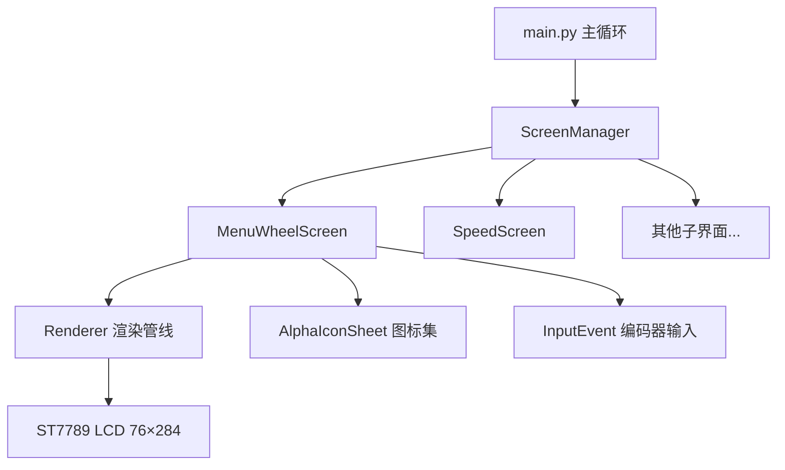
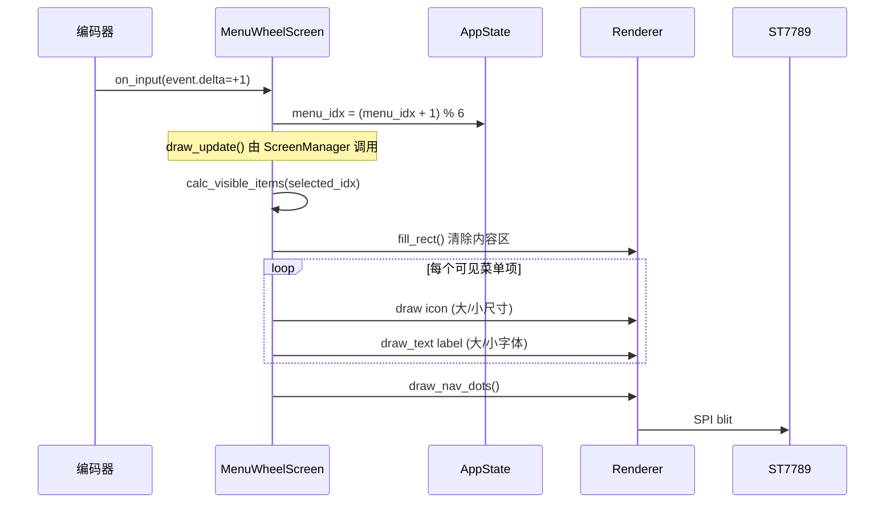
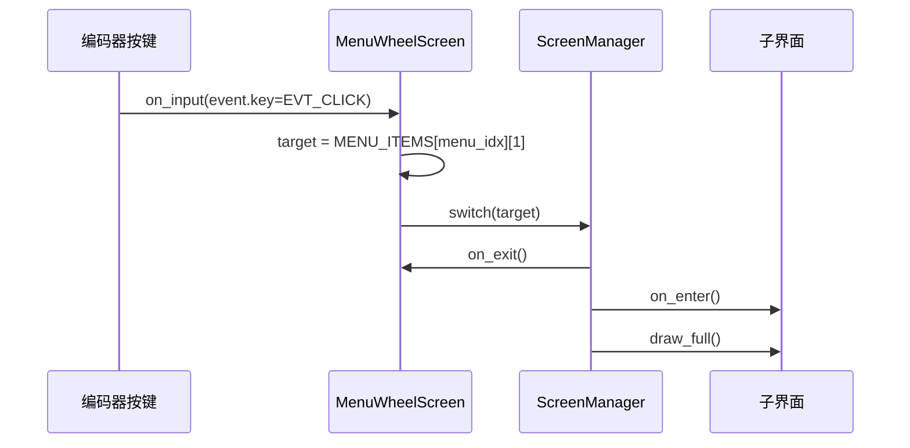

# 设计文档：滑动式菜单滚轮界面 (Sliding Menu Wheel)

## 概述

本设计为 76×284 横屏 ST7789 LCD 实现一个水平滑动式菜单滚轮界面，替换现有的单项居中菜单。多个菜单项（图标+文字标签）横向并排显示，旋转编码器时整排滑动，选中项居中放大高亮，两侧项缩小淡化，营造"滚轮"视觉效果。

该方案充分利用 284px 的横向宽度，同时在 76px 的纵向空间内紧凑排列图标、标签和导航指示器。设计兼容现有的 `Screen` 基类、`Renderer` 渲染管线和 `InputEvent` 输入系统，仅需替换 `screens/menu.py` 模块。

## 架构



### 界面状态机
stateDiagram-v2
    [*] --> Boot: 开机
    Boot --> MenuWheel: 动画完成
    MenuWheel --> Speed: 单击(idx=0)
    MenuWheel --> Smoke: 单击(idx=1)
    MenuWheel --> Pump: 单击(idx=2)
    MenuWheel --> Preset: 单击(idx=3)
    MenuWheel --> RGB: 单击(idx=4)
    MenuWheel --> Bright: 单击(idx=5)
    Speed --> MenuWheel: 双击返回
    Smoke --> MenuWheel: 双击返回
    Pump --> MenuWheel: 双击返回
    Preset --> MenuWheel: 双击返回
    RGB --> MenuWheel: 双击返回
    Bright --> MenuWheel: 双击返回
```

## 组件与接口

### 组件1：MenuWheelScreen（核心界面类）

**职责**：继承 `Screen` 基类，管理菜单项数据、选中索引，处理编码器旋转和按键事件，调用 Renderer 绘制可见菜单项。

```python
class MenuWheelScreen(Screen):
    def __init__(self, ctx): ...
    def on_enter(self): ...       # 加载图标资源，重置状态
    def on_input(self, event): ...# 旋转切换 / 单击进入
    def draw_full(self, r): ...   # 全屏绘制
    def draw_update(self, r): ... # 局部刷新
    def on_exit(self): ...        # 释放图标资源
```

### 组件2：布局计算（模块级函数）

**职责**：根据选中索引计算每个可见菜单项的 x 坐标、图标尺寸、颜色。

```python
def calc_visible_items(selected_idx: int, total_count: int) -> list:
    """返回: [(item_idx, cx, icon_size, fg_color, font_size), ...]"""
```

## 数据模型

### 菜单项定义

```python
MENU_ITEMS = [
    ("Speed",  UI_SPEED,  "fan_speed",   "%",  0),
    ("Smoke",  UI_SMOKE,  "smoke_speed", "%",  1),
    ("Pump",   UI_PUMP,   "pump_speed",  "%",  2),
    ("Color",  UI_PRESET, "preset_idx",  "",   3),
    ("RGB",    UI_RGB,    None,          "",   4),
    ("Bright", UI_BRIGHT, "brightness",  "%",  5),
]
```

### 布局常量

```python
SCREEN_W = 284          # 屏幕宽度
SCREEN_H = 76           # 屏幕高度
ITEM_SPACING = 64       # 菜单项间距（中心到中心）
CENTER_X = 142          # 屏幕中心 x
ICON_Y = 4              # 图标顶部 y
LABEL_Y_BIG = 40        # 选中项标签 y
LABEL_Y_SMALL = 38      # 侧边项标签 y
DOTS_Y = 70             # 导航点 y
MAX_VISIBLE = 5         # 最大可见项数
```

**验证规则**：
- `0 <= menu_idx < len(MENU_ITEMS)`
- `ITEM_SPACING * 2 < SCREEN_W`（确保至少3项可见）
- 图标索引在 `AlphaIconSheet.count` 范围内

## 序列图

### 旋转编码器切换菜单项



### 单击进入子界面



## 关键函数与形式化规格

### 函数1：calc_visible_items()

```python
def calc_visible_items(selected_idx, total_count):
    """计算所有可见菜单项的显示参数。
    
    中心锚定策略：选中项固定在屏幕中心，
    其余项按固定间距向两侧排列。
    """
    result = []
    for offset in range(-MAX_VISIBLE // 2, MAX_VISIBLE // 2 + 1):
        item_idx = (selected_idx + offset) % total_count
        cx = CENTER_X + offset * ITEM_SPACING
        
        if cx < -ITEM_SPACING // 2 or cx > SCREEN_W + ITEM_SPACING // 2:
            continue
        
        if offset == 0:
            icon_size = 32
            fg_color = ACCENT
            font_size = 16
        elif abs(offset) == 1:
            icon_size = 20
            fg_color = WHITE
            font_size = 8
        else:
            icon_size = 16
            fg_color = GRAY
            font_size = 8
        
        result.append((item_idx, cx, icon_size, fg_color, font_size))
    return result
```

**前置条件**：
- `0 <= selected_idx < total_count`
- `total_count > 0`

**后置条件**：
- 返回列表长度 `<= MAX_VISIBLE`
- 选中项 `(offset=0)` 的 `cx == CENTER_X`
- 所有返回项的 `cx` 在 `[-ITEM_SPACING//2, SCREEN_W + ITEM_SPACING//2]` 范围内
- 返回列表中恰好有一项的 `fg_color == ACCENT`（选中项）

**循环不变量**：
- 每次迭代 `offset` 从 `-MAX_VISIBLE//2` 递增到 `MAX_VISIBLE//2`
- `item_idx` 始终在 `[0, total_count)` 范围内（取模保证）

### 函数2：MenuWheelScreen.on_input()

```python
def on_input(self, event):
    """处理编码器输入事件。"""
    state = self.ctx.state
    if event.delta != 0:
        state.menu_idx = (state.menu_idx + event.delta) % len(MENU_ITEMS)
    if event.key == EVT_CLICK:
        _, target, _, _, _ = MENU_ITEMS[state.menu_idx]
        self.ctx.screen_manager.switch(target)
```

**前置条件**：
- `event` 是有效的 `InputEvent` 实例
- `self.ctx.state.menu_idx` 在有效范围内

**后置条件**：
- 旋转后 `menu_idx` 仍在 `[0, len(MENU_ITEMS))` 范围内
- 单击后 `ScreenManager` 切换到对应子界面
- 不修改除 `menu_idx` 外的任何状态

### 函数3：MenuWheelScreen._draw_item()

```python
def _draw_item(self, r, item_idx, cx, icon_size, fg_color, font_size):
    """绘制单个菜单项（图标 + 标签）。
    
    根据 icon_size 选择图标渲染方式：
    - 有 AlphaIconSheet 且索引有效：使用 RLE 图标
    - 否则：使用字体文字作为 fallback
    """
    label, _, attr, suffix, icon_idx = MENU_ITEMS[item_idx]
    
    # 绘制图标
    if self._icons and 0 <= icon_idx < self._icons.count:
        iw = self._icons.icon_w
        ih = self._icons.icon_h
        ix = cx - iw // 2
        self._icons.draw(r._display, icon_idx, ix, ICON_Y, fg_color, BLACK)
    else:
        # fallback: 用首字母大写显示
        font = get_font(font_size)
        ch = label[0]
        tw = font.text_width(ch)
        r.draw_text(font, ch, cx - tw // 2, ICON_Y + 4, fg_color, BLACK)
    
    # 绘制文字标签
    font = get_font(font_size)
    tw = font.text_width(label)
    label_y = LABEL_Y_BIG if font_size == 16 else LABEL_Y_SMALL
    r.draw_text(font, label, cx - tw // 2, label_y, fg_color, BLACK)
```

**前置条件**：
- `0 <= item_idx < len(MENU_ITEMS)`
- `cx` 在屏幕可见范围内
- `r` 是有效的 `Renderer` 实例

**后置条件**：
- 图标绘制在 `(cx - iw//2, ICON_Y)` 位置
- 标签文字水平居中于 `cx`
- 不修改任何状态变量

## 算法伪代码

### 主绘制算法

```python
def draw_menu_wheel(renderer, state, icons):
    """绘制完整的滑动式菜单滚轮。
    
    前置条件: renderer 已初始化, state.menu_idx 有效
    后置条件: 屏幕显示当前选中项居中的菜单滚轮
    """
    selected = state.menu_idx
    count = len(MENU_ITEMS)
    
    # 步骤1: 清除内容区域（保留导航点区域避免闪烁）
    renderer.fill_rect(0, 0, SCREEN_W, DOTS_Y - 2, BLACK)
    
    # 步骤2: 计算可见项布局
    items = calc_visible_items(selected, count)
    # 不变量: items 按 cx 从左到右排序
    
    # 步骤3: 从两侧向中心绘制（确保选中项在最上层）
    # 先绘制远处项，再绘制近处项，最后绘制选中项
    center_item = None
    side_items = []
    for item in items:
        if item[3] == ACCENT:  # fg_color == ACCENT 表示选中项
            center_item = item
        else:
            side_items.append(item)
    
    for item_idx, cx, icon_size, fg_color, font_size in side_items:
        _draw_item(renderer, item_idx, cx, icon_size, fg_color, font_size)
    
    if center_item:
        item_idx, cx, icon_size, fg_color, font_size = center_item
        _draw_item(renderer, item_idx, cx, icon_size, fg_color, font_size)
    
    # 步骤4: 绘制底部导航点
    draw_nav_dots(renderer, count, selected, cy=DOTS_Y)
```

### 选中项值预览算法（可选增强）

```python
def _draw_value_preview(renderer, state, item_idx):
    """在选中项标签下方显示当前值预览。
    
    前置条件: item_idx 有效
    后置条件: 在标签下方显示对应状态值的文字
    """
    label, _, attr, suffix, _ = MENU_ITEMS[item_idx]
    if attr is None:
        return  # RGB 等无单一数值的项不显示
    
    value = getattr(state, attr, 0)
    text = "{}{}".format(value, suffix)
    font = get_font(8)
    tw = font.text_width(text)
    renderer.draw_text(font, text, CENTER_X - tw // 2, LABEL_Y_BIG + 14,
                       GRAY, BLACK)
```

## 示例用法

```python
# 在 main.py 中注册菜单界面
from screens.menu import MenuWheelScreen

menu_screen = MenuWheelScreen(ctx)
screen_manager.register(UI_MENU, menu_screen)

# ScreenManager 自动管理生命周期:
# 1. switch(UI_MENU) → on_enter() 加载图标
# 2. 每帧 dispatch(event) → on_input() 处理旋转/按键
# 3. 每帧 render() → draw_update() 局部刷新
# 4. switch(其他) → on_exit() 释放图标
```

```python
# 布局计算示例
items = calc_visible_items(selected_idx=2, total_count=6)
# 返回:
# [
#   (0, 14,  16, GRAY,   8),   # Pump左2: x=14, 小图标, 灰色
#   (1, 78,  20, WHITE,  8),   # Color左1: x=78, 中图标, 白色
#   (2, 142, 32, ACCENT, 16),  # RGB选中: x=142, 大图标, 强调色
#   (3, 206, 20, WHITE,  8),   # Bright右1: x=206, 中图标, 白色
#   (4, 270, 16, GRAY,   8),   # Speed右2: x=270, 小图标, 灰色
# ]
```

## 正确性属性

*属性是系统在所有有效执行中应保持为真的特征或行为——本质上是关于系统应做什么的形式化陈述。属性是人类可读规格与机器可验证正确性保证之间的桥梁。*

### 属性 1：可见项数量上界

*对于任意* 有效的 selected_idx ∈ [0, total_count) 和 total_count > 0，calc_visible_items 返回的列表长度应不超过 MAX_VISIBLE。

**验证需求: 1.1**

### 属性 2：选中项居中且参数正确

*对于任意* 有效的 selected_idx，calc_visible_items 返回的列表中应恰好有一项 fg_color == ACCENT，且该项的 cx == CENTER_X（142），icon_size == 32，font_size == 16。

**验证需求: 1.2, 1.4**

### 属性 3：尺寸梯度

*对于任意* 有效的 selected_idx，calc_visible_items 返回的列表中，offset=±1 的项应具有 icon_size=20、fg_color=WHITE、font_size=8，offset=±2 的项应具有 icon_size=16、fg_color=GRAY、font_size=8。

**验证需求: 1.3**

### 属性 4：可见项坐标边界

*对于任意* 有效的 selected_idx，calc_visible_items 返回的所有项的 cx 应在 [-ITEM_SPACING//2, SCREEN_W + ITEM_SPACING//2] 范围内。

**验证需求: 1.5**

### 属性 5：可见项索引唯一性

*对于任意* 有效的 selected_idx，calc_visible_items 返回的列表中不应存在重复的 item_idx。

**验证需求: 1.6**

### 属性 6：菜单索引边界不变量

*对于任意* 初始 menu_idx ∈ [0, len(MENU_ITEMS)) 和任意编码器增量序列（正、负、零），每次旋转操作后 menu_idx 应始终满足 0 <= menu_idx < len(MENU_ITEMS)。

**验证需求: 2.1, 2.2, 2.3, 8.1, 8.2**

### 属性 7：旋转事件状态隔离

*对于任意* 旋转事件（delta != 0），on_input 处理后 AppState 中除 menu_idx 外的所有属性应保持不变。

**验证需求: 2.5**

### 属性 8：单击映射正确性

*对于任意* 有效的 menu_idx，单击事件应触发 ScreenManager.switch() 且参数等于 MENU_ITEMS[menu_idx][1]。

**验证需求: 3.1, 3.2**

## 错误处理

### 场景1：图标资源加载失败

**条件**: `assets/menu_icons_alpha.bin` 文件不存在或格式错误
**响应**: `_icons` 设为 `None`，打印警告日志
**恢复**: 自动降级为文字首字母显示模式，功能不受影响

### 场景2：编码器增量过大

**条件**: 快速旋转导致单帧 `delta` 绝对值 > 1
**响应**: 取模运算保证 `menu_idx` 始终有效，一次跳过多项
**恢复**: 无需恢复，属于正常快速导航行为

### 场景3：内存不足

**条件**: RP2040 可用内存不足以加载图标集
**响应**: `AlphaIconSheet()` 构造抛出 `MemoryError`，被 `try/except` 捕获
**恢复**: 降级为无图标模式，`on_exit()` 确保资源释放

## 测试策略

### 单元测试

- `calc_visible_items()` 纯函数测试：验证各种 `selected_idx` 下的返回值
- `on_input()` 状态转换测试：验证旋转和按键后的状态变化
- 边界测试：`menu_idx` 在 0 和 `len-1` 处的循环行为

### 属性测试

**属性测试库**: hypothesis (Python)

- 属性1: 对任意 `selected_idx ∈ [0, count)`，返回列表长度 `<= MAX_VISIBLE`
- 属性2: 对任意 `selected_idx`，返回列表中恰好有一项 `fg_color == ACCENT`
- 属性3: 对任意 `delta` 序列，`menu_idx` 始终在 `[0, count)` 范围内

### 集成测试

- 验证 `MenuWheelScreen` 与 `ScreenManager` 的切换流程
- 验证图标加载/释放的资源管理
- 验证与现有子界面的双击返回交互

## 性能考量

- **局部刷新**: `draw_update()` 仅在 `menu_idx` 变化时重绘，避免每帧全屏刷新
- **内存预算**: 图标集 `AlphaIconSheet` 使用 RLE 压缩，6 个 32×32 图标约 2-4KB
- **渲染时间**: 最多绘制 5 个项（图标+文字），每项约 2-3ms SPI 传输，总计 < 15ms
- **行缓冲复用**: 使用 `Renderer` 现有的 `284×8×2 = 4544` 字节行缓冲

## 安全考量

- 编码器输入取模运算防止数组越界
- 图标索引范围检查防止非法内存访问
- `try/except` 包裹资源加载防止未处理异常导致系统挂起

## 依赖

- `screens.Screen` 基类（已有）
- `ui.renderer.Renderer` 渲染管线（已有）
- `ui.icon.AlphaIconSheet` 图标加载器（已有）
- `ui.font.get_font()` 字体获取（已有，需支持 8px 和 16px）
- `ui.widgets.draw_nav_dots()` 导航点控件（已有）
- `hal.input.InputEvent` 输入事件（已有）
- `screen_manager.ScreenManager` 界面管理器（已有）
- `assets/menu_icons_alpha.bin` 图标资源文件（需更新：6 个图标）

## 屏幕布局示意图

```
┌──────────────────────────────────────────────────────────────────┐
│  284px                                                           │
│                                                                  │
│   [小图标]    [中图标]    [★大图标★]    [中图标]    [小图标]      │ 76px
│    灰色        白色       强调色高亮      白色        灰色        │
│   Pump       Color      ★ RGB ★      Bright      Speed        │
│                                                                  │
│                    ○ ○ ● ○ ○ ○                                  │
└──────────────────────────────────────────────────────────────────┘
     x≈14       x≈78      x=142        x≈206       x≈270
```
